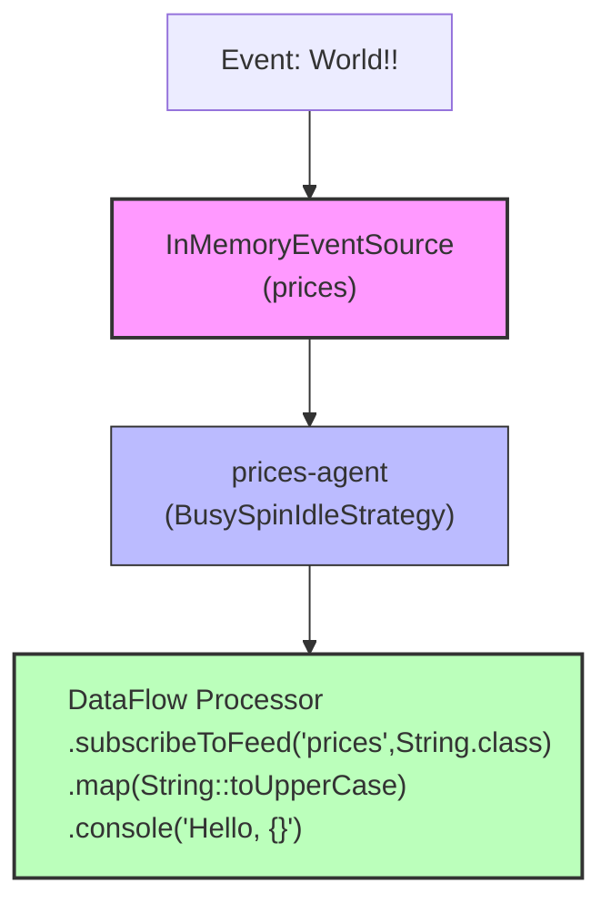

# Stream Programming Tutorial Example

Mongoose project homepage: https://telaminai.github.io/mongoose/

[](https://github.com/telaminai/mongoose-examples/actions/workflows/ci.yml)

This Maven project demonstrates native Fluxtion DataFlow stream programming integrated into a Mongoose server. With the
native integration, all lifecycle and subscription management is handled automatically by Mongoose — you focus on
declaring the stream graph.

Main class for this example:

- [StreamProgrammingTutorial](src/main/java/com/telamin/mongoose/example/streamprog/StreamProgrammingTutorial.java)

## What it demonstrates

- Building a dataflow graph with Fluxtion DataFlow API (subscribe → transform → sink)
- Subscribing to a named feed ("prices") directly from the stream using subscribeToFeed
- Automatic lifecycle and subscription integration when running inside Mongoose
- Programmatic configuration of a Mongoose server with an in-memory event feed
- Simple transformation and console output from the dataflow

## Flow diagram



## Sample 

### Create a streaming graph processor

Create a stream graph with a single processor subscribing to a named feed using the DataFlow functional api, 
this is your application logic:

```java
EventProcessor<?> processor = (EventProcessor) DataFlow
        .subscribeToFeed("prices", String.class)
        .map(String::toUpperCase)
        .console("Hello, {}")
        .build();
```

### Full example code:

```java
// Feed config
public static void main(String[] args) {
    //build data stream processor subscribing to prices feed, with a simple map function and console output
    EventProcessor<?> processor = (EventProcessor) DataFlow.subscribeToFeed("prices", String.class)
            .map(String::toUpperCase)
            .console("Hello, {}")
            .build();

    EventProcessorConfig<EventProcessor<?>> eventProcessorConfig = EventProcessorConfig.builder()
            .name("filter-processor")
            .handler(processor)
            .build();

    // Build EventFeed configs with name: 'prices'
    InMemoryEventSource<String> prices = new InMemoryEventSource<>();
    EventFeedConfig<?> pricesFeed = EventFeedConfig.builder()
            .instance(prices)
            .name("prices")
            .wrapWithNamedEvent(true)
            .agent("prices-agent", new BusySpinIdleStrategy())
            .build();

    // build server config
    MongooseServerConfig mongooseServerConfig = MongooseServerConfig.builder()
            .addProcessor("processor-agent", eventProcessorConfig)
            .addEventFeed(pricesFeed)
            .build();

    //boot server
    MongooseServer.bootServer(mongooseServerConfig);

    //send some data
    prices.offer("World!!");
}
```

Expected console output:

```
Hello, WORLD!!
```

## Prerequisites

- Java 21+
- Maven 3.8+
- Access to the com.telamin:mongoose dependency (installed locally or available in your Maven repositories)
    - If developing alongside Mongoose, run `mvn -q install` in the Mongoose project first and ensure versions match.

## Build

From this project directory:

```bash
mvn clean install
```

Or from the repository root:

```bash
./mvnw -pl gettting-started/stream-programming-tutorial clean install
```

## Run

Run via IDE by setting the main class to:

- com.telamin.mongoose.example.streamprog.StreamProgrammingTutorial

Or from command line after building:

```bash
java -cp target/stream-programming-tutorial-*.jar \
  com.telamin.mongoose.example.streamprog.StreamProgrammingTutorial
```

## How this differs from the Five Minute tutorials

- Five Minute examples show selective processing with a custom handler subscribing to named feeds.
- This stream programming tutorial shows the native Fluxtion DataFlow integration where the stream graph itself
  subscribes to the feed, and Mongoose manages lifecycle and subscriptions automatically.

## Links

- Mongoose GitHub Repository: https://github.com/telaminai/mongoose
- Mongoose Project Homepage: https://telaminai.github.io/mongoose/
- Fluxtion Project: https://github.com/v12technology/fluxtion
