# How To: CPU Core Pinning for Agent Threads

**Mongoose project homepage:** https://telaminai.github.io/mongoose/

[](https://github.com/telaminai/mongoose-examples/actions/workflows/ci.yml)

This is a Maven project that demonstrates how to pin Mongoose server agent threads to specific CPU cores for improved determinism and reduced context switching. The example shows how to:

- Configure per-agent core IDs using ThreadConfig.coreId in MongooseServerConfig
- Set up multiple agent groups with different core assignments and idle strategies
- Demonstrate workload distribution across pinned cores
- Apply best practices for core assignment in multi-agent systems
- Understand the benefits and trade-offs of core pinning

The example's main class:

- [CorePinExample](src/main/java/com/telamin/mongoose/example/howto/CorePinExample.java)

## Flow Diagram

The following diagram illustrates the core pinning architecture:

```mermaid
flowchart TD
    %% CPU Cores
    core0["CPU Core 0<br>(High Priority Agent)"]
    core1["CPU Core 1<br>(Medium Priority Agent)"]
    core2["CPU Core 2<br>(Low Priority Agent)"]
    core3["CPU Core 3<br>(High Priority Feed Agent)"]
    core4["CPU Core 4<br>(Medium Priority Feed Agent)"]
    core5["CPU Core 5<br>(Low Priority Feed Agent)"]
    
    %% Agent Groups
    highPriorityAgent["High Priority Agent<br>(BusySpinIdleStrategy)"]
    mediumPriorityAgent["Medium Priority Agent<br>(SleepingMillisIdleStrategy 1ms)"]
    lowPriorityAgent["Low Priority Agent<br>(SleepingMillisIdleStrategy 10ms)"]
    
    %% Feed Agents
    highFeedAgent["High Priority Feed Agent<br>(BusySpinIdleStrategy)"]
    mediumFeedAgent["Medium Priority Feed Agent<br>(SleepingMillisIdleStrategy 1ms)"]
    lowFeedAgent["Low Priority Feed Agent<br>(SleepingMillisIdleStrategy 5ms)"]
    
    %% Processors
    highProcessor["High Priority Processor<br>(Minimal latency)"]
    mediumProcessor["Medium Priority Processor<br>(100μs work simulation)"]
    lowProcessor["Low Priority Processor<br>(1ms work simulation)"]
    
    %% Event Sources
    highSource["High Priority Events<br>(100 events)"]
    mediumSource["Medium Priority Events<br>(50 events)"]
    lowSource["Low Priority Events<br>(20 events)"]
    
    %% Sink
    sink["InMemoryMessageSink<br>(Collects all processed events)"]
    
    %% Core pinning
    core0 -.-> |"Pinned to"| highPriorityAgent
    core1 -.-> |"Pinned to"| mediumPriorityAgent
    core2 -.-> |"Pinned to"| lowPriorityAgent
    core3 -.-> |"Pinned to"| highFeedAgent
    core4 -.-> |"Pinned to"| mediumFeedAgent
    core5 -.-> |"Pinned to"| lowFeedAgent
    
    %% Agent to processor relationships
    highPriorityAgent --> highProcessor
    mediumPriorityAgent --> mediumProcessor
    lowPriorityAgent --> lowProcessor
    
    %% Feed to agent relationships
    highSource --> highFeedAgent
    mediumSource --> mediumFeedAgent
    lowSource --> lowFeedAgent
    
    %% Feed agents to processors
    highFeedAgent --> highProcessor
    mediumFeedAgent --> mediumProcessor
    lowFeedAgent --> lowProcessor
    
    %% Output to sink
    highProcessor --> sink
    mediumProcessor --> sink
    lowProcessor --> sink
    
    %% Styling
    classDef core fill:#ffcccc,stroke:#333,stroke-width:2px
    classDef agent fill:#ccffcc,stroke:#333,stroke-width:2px
    classDef processor fill:#ccccff,stroke:#333,stroke-width:2px
    classDef source fill:#ffffcc,stroke:#333,stroke-width:2px
    classDef sink fill:#ffccff,stroke:#333,stroke-width:2px
    
    class core0,core1,core2,core3,core4,core5 core
    class highPriorityAgent,mediumPriorityAgent,lowPriorityAgent,highFeedAgent,mediumFeedAgent,lowFeedAgent agent
    class highProcessor,mediumProcessor,lowProcessor processor
    class highSource,mediumSource,lowSource source
    class sink sink
```



Mongoose maven dependency:

```xml
<dependencies>
    <dependency>
        <groupId>com.telamin</groupId>
        <artifactId>mongoose</artifactId>
        <version>${mongoose.version}</version>
    </dependency>
    <!-- Optional: For actual OS-level pinning -->
    <dependency>
        <groupId>net.openhft</groupId>
        <artifactId>affinity</artifactId>
        <version>3.27ea0</version>
        <optional>true</optional>
    </dependency>
</dependencies>
```

## What it demonstrates

- Configuring core pinning using ThreadConfig.coreId in MongooseServerConfig
- Setting up multiple agent groups with different priority levels and core assignments
- Using different idle strategies (BusySpinIdleStrategy vs SleepingMillisIdleStrategy) based on priority
- Demonstrating workload distribution across pinned cores
- Capturing thread information to verify pinning configuration
- Best practices for core assignment in latency-sensitive applications
- Understanding the benefits of reduced context switching and improved cache locality

## Prerequisites

- Java 21+
- Maven 3.8+
- Multi-core CPU (example is configured for 6+ cores)
- Access to the com.telamin:mongoose dependency (installed locally or available in your Maven repositories)
    - If you are developing alongside the Mongoose repo, run `mvn -q install` in the Mongoose project first to install
      it to your local repository, and ensure the version in this example's pom.xml (<mongoose.version>) matches.
- Optional: OpenHFT Affinity library for actual OS-level thread pinning

## Sample code

### Basic Core Pinning Configuration

```java
MongooseServerConfig serverConfig = MongooseServerConfig.builder()
    // High priority processor pinned to core 0
    .addThread(ThreadConfig.builder()
        .agentName("high-priority-agent")
        .idleStrategy(new BusySpinIdleStrategy())
        .coreId(0) // Pin to core 0 for lowest latency
        .build())
    .addProcessorGroup(EventProcessorGroupConfig.builder()
        .agentName("high-priority-agent")
        .put("high-priority-processor", new EventProcessorConfig(processor))
        .build())
    
    // Medium priority processor pinned to core 1
    .addThread(ThreadConfig.builder()
        .agentName("medium-priority-agent")
        .idleStrategy(new SleepingMillisIdleStrategy(1))
        .coreId(1) // Pin to core 1
        .build())
    .build();
```

### Thread Information Capture

```java
public static class CorePinnedProcessor extends ObjectEventHandlerNode {
    private volatile long threadId = -1;
    private volatile String threadName = "unknown";

    @Override
    public void start() {
        // Capture thread information when processor starts
        Thread currentThread = Thread.currentThread();
        this.threadId = currentThread.getId();
        this.threadName = currentThread.getName();
        
        System.out.println("Processor started on thread: " + 
                         threadName + " (ID: " + threadId + ")");
    }
}
```

### High-Performance Configuration Pattern

```java
public static MongooseServerConfig.Builder createHighPerformanceConfig() {
    return MongooseServerConfig.builder()
        // Critical path: Core 0 with BusySpinIdleStrategy
        .addThread(ThreadConfig.builder()
            .agentName("critical-agent")
            .idleStrategy(new BusySpinIdleStrategy())
            .coreId(0)
            .build())
        
        // Event sources: Core 1
        .addThread(ThreadConfig.builder()
            .agentName("source-agent")
            .idleStrategy(new BusySpinIdleStrategy())
            .coreId(1)
            .build())
        
        // Background processing: Core 2
        .addThread(ThreadConfig.builder()
            .agentName("background-agent")
            .idleStrategy(new SleepingMillisIdleStrategy(1))
            .coreId(2)
            .build());
}
```

### NUMA-Aware Configuration

```java
public static MongooseServerConfig.Builder createNUMAConfig() {
    return MongooseServerConfig.builder()
        // NUMA node 0: Cores 0-3
        .addThread(ThreadConfig.builder()
            .agentName("numa0-critical")
            .coreId(0)
            .build())
        .addThread(ThreadConfig.builder()
            .agentName("numa0-processing")
            .coreId(1)
            .build())
        
        // NUMA node 1: Cores 4-7 (assuming 8-core dual-socket)
        .addThread(ThreadConfig.builder()
            .agentName("numa1-processing")
            .coreId(4)
            .build());
}
```

## Running the example

From the project root:

```bash
cd how-to/core-pin
mvn clean compile exec:java -Dexec.mainClass="com.telamin.mongoose.example.howto.CorePinExample"
```

Expected output:
```
Core Pin Example Started
Demonstrating CPU core pinning for agent threads...

System Information:
Available CPU cores: 8
Recommended core assignment:
  - High priority: Core 0 (BusySpinIdleStrategy)
  - Medium priority: Core 1 (SleepingMillisIdleStrategy 1ms)
  - Low priority: Core 2 (SleepingMillisIdleStrategy 10ms)
  - Feed agents: Cores 3-5

Core pinning configured. Server started with pinned agent threads.
Note: Actual OS-level pinning requires OpenHFT Affinity dependency.

HIGH_PRIORITY processor started on thread: high-priority-agent (ID: 23)
MEDIUM_PRIORITY processor started on thread: medium-priority-agent (ID: 24)
LOW_PRIORITY processor started on thread: low-priority-agent (ID: 25)

Generating workload across different priority levels...
Workload generated:
  - High priority: 100 events
  - Medium priority: 50 events
  - Low priority: 20 events

Processing Results:
High Priority Processor:
  - Events processed: 100
  - Thread ID: 23
  - Thread name: high-priority-agent
Medium Priority Processor:
  - Events processed: 50
  - Thread ID: 24
  - Thread name: medium-priority-agent
Low Priority Processor:
  - Events processed: 20
  - Thread ID: 25
  - Thread name: low-priority-agent
Total messages in sink: 170

Core Pinning Benefits:
  - Reduced context switching between cores
  - Better CPU cache locality
  - More predictable latency characteristics
  - Isolation of high-priority workloads
```

## Key concepts

- **Core Pinning**: Binding agent threads to specific CPU cores to reduce context switching
- **ThreadConfig.coreId**: Zero-based CPU core index for pinning configuration
- **Idle Strategies**: Different strategies (BusySpinIdleStrategy vs SleepingMillisIdleStrategy) based on priority
- **Agent Groups**: Logical grouping of processors that can be pinned to specific cores
- **NUMA Awareness**: Considering Non-Uniform Memory Access topology for optimal performance
- **Cache Locality**: Keeping related processing on the same core for better cache utilization
- **Priority Isolation**: Separating high-priority workloads from background processing

## Benefits and trade-offs

### Benefits:
- **Reduced Context Switching**: Threads stay on assigned cores, reducing OS scheduler overhead
- **Better Cache Locality**: CPU caches remain warm for pinned threads
- **Predictable Latency**: More consistent performance characteristics
- **Priority Isolation**: High-priority workloads aren't interrupted by lower-priority tasks
- **NUMA Optimization**: Can optimize for memory locality in multi-socket systems

### Trade-offs:
- **Reduced Flexibility**: OS scheduler can't dynamically balance load across cores
- **Resource Utilization**: May lead to some cores being underutilized
- **Complexity**: Requires understanding of system topology and workload characteristics
- **Platform Dependency**: Effectiveness varies by CPU architecture and OS

## Verification and troubleshooting

### Verifying Core Pinning:
1. **Thread Information**: Check thread IDs and names in application logs
2. **OS Tools**: Use `taskset -cp <pid>` on Linux to check thread affinity
3. **Performance Monitoring**: Monitor CPU utilization per core
4. **Latency Testing**: Measure tail latency improvements

### Common Issues:
- **Missing OpenHFT Affinity**: Pinning is logged but not applied at OS level
- **Invalid Core IDs**: Ensure core IDs exist on the target system
- **Insufficient Cores**: Example requires 6+ cores for optimal demonstration
- **NUMA Considerations**: Sub-optimal placement across NUMA nodes

## Related documentation

- Related how-to guide: [How to core-pin agent threads](https://telaminai.github.io/mongoose/how-to/how-to-core-pin/)
- [Threading Model](https://telaminai.github.io/mongoose/architecture/threading-model/)
- [ThreadConfig API](https://telaminai.github.io/mongoose/reference/thread-config/)
- [Performance Tuning](https://telaminai.github.io/mongoose/performance/tuning-guide/)