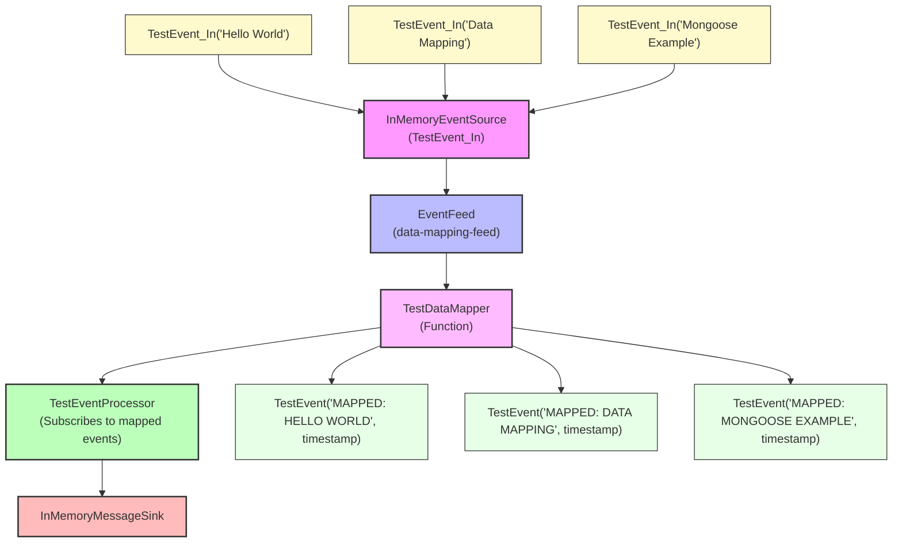

# How To: Transform Events with Data Mapping

**Mongoose project homepage:** https://telaminai.github.io/mongoose/

[](https://github.com/telaminai/mongoose-examples/actions/workflows/ci.yml)

This is a Maven project that demonstrates how to transform incoming feed events to a different type using value mapping. The example shows how to:

- Create a value mapper Function<Input, ?> that converts input events to target types
- Configure an EventFeed with the value mapper via .valueMapper(...)
- Subscribe to the mapped events from a processor
- Process the transformed events in downstream handlers

The example's main class:

- [DataMappingExample](src/main/java/com/telamin/mongoose/example/howto/DataMappingExample.java)

## Flow Diagram

The following diagram illustrates the flow of events through the data mapping system:



Mongoose maven dependency:

```xml
<dependencies>
    <dependency>
        <groupId>com.telamin</groupId>
        <artifactId>mongoose</artifactId>
        <version>${mongoose.version}</version>
    </dependency>
</dependencies>
```

## What it demonstrates

- Creating input and target event types (TestEvent_In and TestEvent)
- Implementing a value mapper that transforms input events to target types
- Configuring an EventFeed with a value mapper using .valueMapper()
- Subscribing to mapped events from a processor using getContext().subscribeToNamedFeed()
- Processing transformed events in downstream handlers
- Demonstrating that the processor receives the mapped type, not the original input type

## Prerequisites

- Java 21+
- Maven 3.8+
- Access to the com.telamin:mongoose dependency (installed locally or available in your Maven repositories)
    - If you are developing alongside the Mongoose repo, run `mvn -q install` in the Mongoose project first to install
      it to your local repository, and ensure the version in this example's pom.xml (<mongoose.version>) matches.

## Sample code

### Input and Target Event Types

```java
// Input event type arriving at the EventFeed
public record TestEvent_In(String message) {}

// Target event type after mapping
public record TestEvent(String transformedMessage, long timestamp) {}
```

### Value Mapper Implementation

```java
public static class TestDataMapper implements Function<TestEvent_In, Object> {
    @Override
    public Object apply(TestEvent_In input) {
        // Transform the input event to target type
        String transformed = "MAPPED: " + input.message().toUpperCase();
        return new TestEvent(transformed, System.currentTimeMillis());
    }
}
```

### EventFeed Configuration with Value Mapper

```java
Function<TestEvent_In, Object> mapper = new TestDataMapper();

EventFeedConfig<TestEvent_In> feedConfig = EventFeedConfig
        .<TestEvent_In>builder()
        .instance(eventSource)
        .name("data-mapping-feed")
        .valueMapper(mapper)          // Transform input events
        .broadcast(true)
        .wrapWithNamedEvent(false)
        .build();
```

### Processor Subscribing to Mapped Events

```java
public static class TestEventProcessor extends ObjectEventHandlerNode {
    private volatile TestEvent lastProcessedEvent;
    private volatile int processedCount = 0;
    
    @Override
    public void start() {
        // Subscribe to the mapped output from the named feed
        getContext().subscribeToNamedFeed("data-mapping-feed");
    }
    
    @Override
    protected boolean handleEvent(Object event) {
        // After mapping, events arriving here are TestEvent instances
        if (event instanceof TestEvent testEvent) {
            lastProcessedEvent = testEvent;
            processedCount++;
            System.out.println("Processed mapped event: " + testEvent);
        }
        return true; // continue processing chain
    }
}
```

## Running the example

From the project root:

```bash
cd how-to/data-mapping
mvn clean compile exec:java -Dexec.mainClass="com.telamin.mongoose.example.howto.DataMappingExample"
```

Expected output:
```
Data Mapping Example Started
Publishing input events...

Processed Events:
Processed mapped event: TestEvent[transformedMessage=MAPPED: HELLO WORLD, timestamp=1234567890123]
Processed mapped event: TestEvent[transformedMessage=MAPPED: DATA MAPPING, timestamp=1234567890124]
Processed mapped event: TestEvent[transformedMessage=MAPPED: MONGOOSE EXAMPLE, timestamp=1234567890125]
Last processed event: TestEvent[transformedMessage=MAPPED: MONGOOSE EXAMPLE, timestamp=1234567890125]
Total events processed: 3

Data Mapping Example Completed
```

## Key concepts

- **Value Mapping**: Transform events at the feed boundary before they reach processors
- **Type Safety**: Processors work with the target type, not the original input type
- **Feed Configuration**: Use .valueMapper() to attach transformation logic to feeds
- **Named Feed Subscription**: Processors subscribe to feeds by name to receive mapped events
- **Transformation Logic**: Mappers can perform validation, enrichment, filtering, or type conversion

## Related documentation

- Related how-to guide: [How to transform incoming feed events to a different type](https://telaminai.github.io/mongoose/how-to/how-to-data-mapping/)
- [EventFeed Configuration](https://telaminai.github.io/mongoose/reference/event-feeds/)
- [Event Processing](https://telaminai.github.io/mongoose/reference/event-processing/)