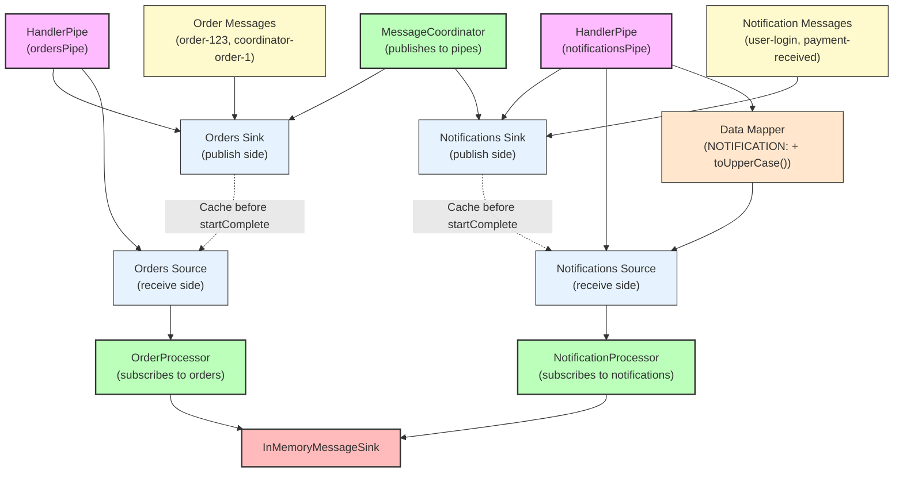

# How To: Use HandlerPipe for In-VM Communication

**Mongoose project homepage:** https://telaminai.github.io/mongoose/

[](https://github.com/telaminai/mongoose-examples/actions/workflows/ci.yml)

This is a Maven project that demonstrates how to use HandlerPipe for lightweight, in-VM communication between handlers. The example shows how to:

- Create HandlerPipe instances for message passing between handlers
- Use the sink side to publish messages and the source side to receive them
- Implement lifecycle-aware caching and replay of events
- Apply data mapping and transformation to messages
- Coordinate multiple pipes for different message types

The example's main class:

- [HandlerPipeExample](src/main/java/com/telamin/mongoose/example/howto/HandlerPipeExample.java)

## Flow Diagram

The following diagram illustrates the HandlerPipe communication flow:



Mongoose maven dependency:

```xml
<dependencies>
    <dependency>
        <groupId>com.telamin</groupId>
        <artifactId>mongoose</artifactId>
        <version>${mongoose.version}</version>
    </dependency>
</dependencies>
```

## What it demonstrates

- Creating HandlerPipe instances with cacheEventLog for lifecycle-aware dispatch
- Using the sink side (pipe.sink()) to publish messages from anywhere in the JVM
- Using the source side (pipe.getSource()) to integrate with Mongoose's event flow
- Subscribing to pipe feeds using getContext().subscribeToNamedFeed()
- Data mapping with pipe.dataMapper() to transform messages before dispatch
- Coordinating multiple pipes for different message types
- Lifecycle semantics: caching events before startComplete and replaying them

## Prerequisites

- Java 21+
- Maven 3.8+
- Access to the com.telamin:mongoose dependency (installed locally or available in your Maven repositories)
    - If you are developing alongside the Mongoose repo, run `mvn -q install` in the Mongoose project first to install
      it to your local repository, and ensure the version in this example's pom.xml (<mongoose.version>) matches.

## Sample code

### Creating HandlerPipe with Caching

```java
// Create pipes for different message types
HandlerPipe<String> ordersPipe = HandlerPipe.<String>of("ordersPipe").cacheEventLog(true);
HandlerPipe<String> notificationsPipe = HandlerPipe.<String>of("notificationsPipe").cacheEventLog(true);

// Add data mapping to transform messages
notificationsPipe.dataMapper(msg -> "NOTIFICATION: " + msg.toUpperCase());
```

### Publishing to Pipes

```java
public class MessageCoordinator extends ObjectEventHandlerNode {
    private final HandlerPipe<String> ordersPipe;
    private final HandlerPipe<String> notificationsPipe;

    public void publishTestMessages() {
        // Publish to orders pipe
        ordersPipe.sink().accept("coordinator-order-1");
        ordersPipe.sink().accept("coordinator-order-2");
        
        // Publish to notifications pipe
        notificationsPipe.sink().accept("coordinator-notification-1");
        notificationsPipe.sink().accept("coordinator-notification-2");
    }
}
```

### Subscribing to Pipe Feeds

```java
public static class OrderProcessor extends ObjectEventHandlerNode {
    @Override
    public void start() {
        // Subscribe to the orders pipe
        getContext().subscribeToNamedFeed("ordersPipe");
    }

    @Override
    protected boolean handleEvent(Object event) {
        if (event instanceof String orderMessage) {
            String processedOrder = "PROCESSED_ORDER: " + orderMessage;
            System.out.println("OrderProcessor: " + processedOrder);
        }
        return true;
    }
}
```

### Configuring Pipe Sources as Event Feeds

```java
// Configure the pipe sources as event feeds
EventFeedConfig<?> ordersFeed = EventFeedConfig.builder()
        .instance(ordersPipe.getSource())
        .name(ordersPipe.getSource().getName())
        .broadcast(true)
        .agent("orders-agent", new BusySpinIdleStrategy())
        .build();
```

## Running the example

From the project root:

```bash
cd how-to/handler-pipe
mvn clean compile exec:java -Dexec.mainClass="com.telamin.mongoose.example.howto.HandlerPipeExample"
```

Expected output:
```
HandlerPipe Example Started
Demonstrating HandlerPipe communication...

Publishing early messages (will be cached)...
OrderProcessor subscribed to ordersPipe
NotificationProcessor subscribed to notificationsPipe
MessageCoordinator started

Publishing messages after startup...
OrderProcessor: PROCESSED_ORDER[1]: early-order-1
NotificationProcessor: PROCESSED_NOTIFICATION[1]: NOTIFICATION: EARLY-NOTIFICATION-1
OrderProcessor: PROCESSED_ORDER[2]: order-123
OrderProcessor: PROCESSED_ORDER[3]: order-456
NotificationProcessor: PROCESSED_NOTIFICATION[2]: NOTIFICATION: USER-LOGIN
NotificationProcessor: PROCESSED_NOTIFICATION[3]: NOTIFICATION: PAYMENT-RECEIVED

Coordinator publishing test messages...
OrderProcessor: PROCESSED_ORDER[4]: coordinator-order-1
OrderProcessor: PROCESSED_ORDER[5]: coordinator-order-2
NotificationProcessor: PROCESSED_NOTIFICATION[4]: NOTIFICATION: COORDINATOR-NOTIFICATION-1
NotificationProcessor: PROCESSED_NOTIFICATION[5]: NOTIFICATION: COORDINATOR-NOTIFICATION-2

Processed messages:
PROCESSED_ORDER[1]: early-order-1
PROCESSED_NOTIFICATION[1]: NOTIFICATION: EARLY-NOTIFICATION-1
PROCESSED_ORDER[2]: order-123
PROCESSED_ORDER[3]: order-456
PROCESSED_NOTIFICATION[2]: NOTIFICATION: USER-LOGIN
PROCESSED_NOTIFICATION[3]: NOTIFICATION: PAYMENT-RECEIVED

HandlerPipe Example Completed
```

## Key concepts

- **HandlerPipe**: Lightweight in-VM pipe coupling a MessageSink (publish side) and InMemoryEventSource (receive side)
- **Lifecycle-aware Caching**: Events published before startComplete are cached and replayed when the system is ready
- **Data Mapping**: Transform messages before dispatch using pipe.dataMapper()
- **Named Feed Subscription**: Processors subscribe to pipe feeds by name using getContext().subscribeToNamedFeed()
- **In-VM Communication**: No external IO required, all communication happens within the same JVM
- **Broadcast Support**: Multiple processors can subscribe to the same pipe feed

## Related documentation

- Related how-to guide: [Use HandlerPipe for in-VM communication between handlers](https://telaminai.github.io/mongoose/how-to/how-to-handler-pipe/)
- [Event Sources](https://telaminai.github.io/mongoose/reference/event-sources/)
- [Message Sinks](https://telaminai.github.io/mongoose/reference/message-sinks/)