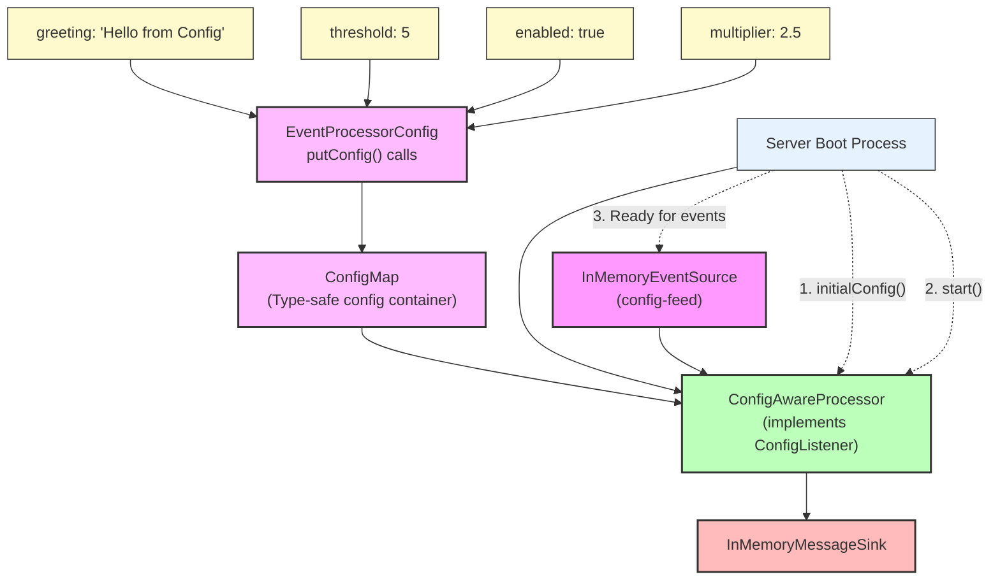

# How To: Injecting Config into a Processor

**Mongoose project homepage:** https://telaminai.github.io/mongoose/

[](https://github.com/telaminai/mongoose-examples/actions/workflows/ci.yml)

This is a Maven project that demonstrates how to inject initial configuration into event processors at server boot time. The example shows how to:

- Create processors that implement ConfigListener to receive configuration
- Use ConfigMap and ConfigKey for type-safe configuration access
- Configure processors with initial values using EventProcessorConfig.putConfig()
- Access configuration values during processor initialization and runtime

The example's main class:

- [InjectingConfigIntoProcessorExample](src/main/java/com/telamin/mongoose/example/howto/InjectingConfigIntoProcessorExample.java)

## Flow Diagram

The following diagram illustrates the configuration injection flow:



Mongoose maven dependency:

```xml
<dependencies>
    <dependency>
        <groupId>com.telamin</groupId>
        <artifactId>mongoose</artifactId>
        <version>${mongoose.version}</version>
    </dependency>
</dependencies>
```

## What it demonstrates

- Creating processors that implement ConfigListener interface
- Using ConfigMap.getOrDefault() with ConfigKey for type-safe configuration access
- Configuring processors using EventProcessorConfig.builder().putConfig()
- How configuration is delivered during server boot before event processing starts
- Using configuration values to control processor behavior (enabled/disabled, thresholds, etc.)
- Mixing different configuration types (String, Integer, Boolean, Double)

## Prerequisites

- Java 21+
- Maven 3.8+
- Access to the com.telamin:mongoose dependency (installed locally or available in your Maven repositories)
    - If you are developing alongside the Mongoose repo, run `mvn -q install` in the Mongoose project first to install
      it to your local repository, and ensure the version in this example's pom.xml (<mongoose.version>) matches.

## Sample code

### ConfigListener Implementation

```java
public static class ConfigAwareProcessor extends ObjectEventHandlerNode implements ConfigListener {
    
    private String greeting = "Default Greeting";
    private int threshold = 10;
    private boolean enabled = false;
    private double multiplier = 1.0;

    @Override
    public boolean initialConfig(ConfigMap config) {
        // Use ConfigKey for type-safe configuration access
        this.greeting = config.getOrDefault(ConfigKey.of("greeting", String.class), "Default Greeting");
        this.threshold = config.getOrDefault(ConfigKey.of("threshold", Integer.class), 10);
        this.enabled = config.getOrDefault(ConfigKey.of("enabled", Boolean.class), false);
        this.multiplier = config.getOrDefault(ConfigKey.of("multiplier", Double.class), 1.0);
        
        return true; // Configuration accepted
    }
}
```

### Configuration Setup

```java
ConfigAwareProcessor processor = new ConfigAwareProcessor();

EventProcessorConfig<?> processorConfig = EventProcessorConfig.builder()
        .customHandler(processor)
        .putConfig("greeting", "Hello from Config")
        .putConfig("threshold", 5)
        .putConfig("enabled", true)
        .putConfig("multiplier", 2.5)
        .build();
```

### Using Configuration in Event Handling

```java
@Override
protected boolean handleEvent(Object event) {
    if (!enabled) {
        System.out.println("Processor disabled, ignoring event: " + event);
        return true;
    }

    if (event instanceof String message) {
        processedCount++;
        
        String processedMessage = greeting + " - " + message + 
            " (count: " + processedCount + ", multiplied: " + (processedCount * multiplier) + ")";
        
        // Check threshold
        if (processedCount >= threshold && !thresholdReached) {
            thresholdReached = true;
            System.out.println("*** THRESHOLD REACHED! ***");
        }
    }
    
    return true;
}
```

## Running the example

From the project root:

```bash
cd how-to/injecting-config-into-a-processor
mvn clean compile exec:java -Dexec.mainClass="com.telamin.mongoose.example.howto.InjectingConfigIntoProcessorExample"
```

Expected output:
```
Config Injection Example Started
Receiving initial configuration...
Configuration loaded successfully
Configuration values:
  greeting: Hello from Config
  threshold: 5
  enabled: true
  multiplier: 2.5

Processor started with configuration:
  enabled: true
  threshold: 5

Publishing test events...
Processed: Hello from Config - event1 (count: 1, multiplied: 2.5)
Processed: Hello from Config - event2 (count: 2, multiplied: 5.0)
Processed: Hello from Config - event3 (count: 3, multiplied: 7.5)
Processed: Hello from Config - event4 (count: 4, multiplied: 10.0)
Processed: Hello from Config - event5 (count: 5, multiplied: 12.5)
*** THRESHOLD REACHED! Processed 5 events ***
Processed: Hello from Config - event6 (count: 6, multiplied: 15.0)

Processed 6 events
Threshold reached: true

Config Injection Example Completed
```

## Key concepts

- **ConfigListener Interface**: Processors implement this to receive initial configuration
- **ConfigMap**: Type-safe container for configuration values
- **ConfigKey**: Type-safe keys for configuration lookup with default values
- **Boot-time Injection**: Configuration is delivered before event processing starts
- **EventProcessorConfig.putConfig()**: Fluent API for setting configuration values
- **Type Safety**: ConfigKey ensures type safety for configuration access

## Related documentation

- Related how-to guide: [How to inject initial config into a processor](https://telaminai.github.io/mongoose/how-to/how-to-injecting-config-into-a-processor/)
- [Configuration Management](https://telaminai.github.io/mongoose/reference/configuration/)
- [Event Processing](https://telaminai.github.io/mongoose/reference/event-processing/)