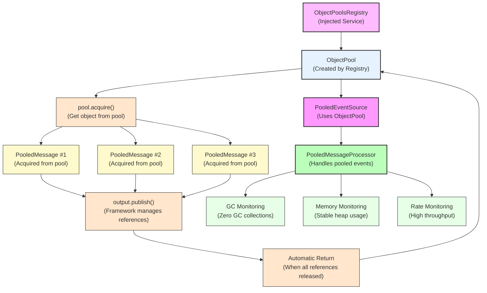

# How To: Zero-GC Object Pooling for High-Performance Event Publishing

**Mongoose project homepage:** https://telaminai.github.io/mongoose/

[](https://github.com/telaminai/mongoose-examples/actions/workflows/ci.yml)

This is a Maven project that demonstrates how to use the global Object Pool for zero-GC high-performance event publishing. The example shows how to:

- Create pooled message types that extend BasePoolAware
- Use ObjectPoolsRegistry to create and manage object pools
- Publish pooled events with automatic reference counting
- Achieve zero-GC event processing at high rates
- Monitor performance with GC and memory statistics

The example's main class:

- [ObjectPoolExample](src/main/java/com/telamin/mongoose/example/howto/ObjectPoolExample.java)

## Flow Diagram

The following diagram illustrates the object pooling flow:



Mongoose maven dependency:

```xml
<dependencies>
    <dependency>
        <groupId>com.telamin</groupId>
        <artifactId>mongoose</artifactId>
        <version>${mongoose.version}</version>
    </dependency>
</dependencies>
```

## What it demonstrates

- Creating pooled message types that extend BasePoolAware for automatic pool management
- Using ObjectPoolsRegistry service injection to create and configure object pools
- Publishing pooled events with automatic reference counting across threads
- Zero-GC event processing at high rates (demonstrated with 100,000+ messages)
- Performance monitoring with GC count, memory usage, and throughput metrics
- Burst publishing patterns and high-rate sustained publishing
- Framework-managed object lifecycle (acquire, publish, automatic return)

## Prerequisites

- Java 21+
- Maven 3.8+
- Access to the com.telamin:mongoose dependency (installed locally or available in your Maven repositories)
    - If you are developing alongside the Mongoose repo, run `mvn -q install` in the Mongoose project first to install
      it to your local repository, and ensure the version in this example's pom.xml (<mongoose.version>) matches.

## Sample code

### Pooled Message Type

```java
public static class PooledMessage extends BasePoolAware {
    public String value;
    public long timestamp;
    public int sequenceNumber;

    @Override
    public String toString() {
        return "PooledMessage{value='" + value + "', timestamp=" + timestamp + ", seq=" + sequenceNumber + '}';
    }
}
```

### Event Source with Object Pool

```java
public static class PooledEventSource extends AbstractEventSourceService<PooledMessage> {
    private ObjectPool<PooledMessage> pool;
    
    public PooledEventSource() {
        super("pooled-event-source");
    }

    @ServiceRegistered
    public void setObjectPoolsRegistry(ObjectPoolsRegistry objectPoolsRegistry, String name) {
        // Create object pool with factory and reset function
        this.pool = objectPoolsRegistry.getOrCreate(
                PooledMessage.class,
                PooledMessage::new,  // Factory function
                pm -> {              // Reset function
                    pm.value = null;
                    pm.timestamp = 0;
                    pm.sequenceNumber = 0;
                }
        );
    }

    public void publish(String value) {
        PooledMessage msg = pool.acquire();
        msg.value = value;
        msg.timestamp = System.currentTimeMillis();
        msg.sequenceNumber = ++sequenceCounter;
        
        output.publish(msg);
        // No manual release needed; framework manages references
    }
}
```

### High-Performance Publishing

```java
private static void demonstrateHighRatePublishing(PooledEventSource eventSource, PooledMessageProcessor processor) throws InterruptedException {
    long startTime = System.nanoTime();
    long startGcCount = getTotalGcCount();
    long startMemory = getUsedMemoryMB();
    
    int messageCount = 100_000;
    
    for (int i = 0; i < messageCount; i++) {
        eventSource.publish("high-rate-message-" + i);
        
        if (i % 10_000 == 0 && i > 0) {
            Thread.sleep(1); // Small pause to prevent overwhelming
        }
    }
    
    // Performance metrics
    long endTime = System.nanoTime();
    long endGcCount = getTotalGcCount();
    long endMemory = getUsedMemoryMB();
    
    long durationMs = TimeUnit.NANOSECONDS.toMillis(endTime - startTime);
    long messagesPerSecond = (messageCount * 1000L) / Math.max(durationMs, 1);
    
    System.out.println("Rate: " + messagesPerSecond + " messages/second");
    System.out.println("GC count increase: " + (endGcCount - startGcCount));
    System.out.println("Memory change: " + (endMemory - startMemory) + " MB");
}
```

## Running the example

From the project root:

```bash
cd how-to/object-pool
mvn clean compile exec:java -Dexec.mainClass="com.telamin.mongoose.example.howto.ObjectPoolExample"
```

Expected output:
```
Object Pool Example Started
Demonstrating zero-GC high-performance event publishing...
ObjectPoolsRegistry injected into PooledEventSource
ObjectPool created for PooledMessage

=== Basic Pooling Demo ===
Published 3 basic pooled messages

=== High-Rate Publishing Demo ===
Processed 10000 messages, rate: 50000 msg/s, heap: 25 MB, GC: 0
Processed 20000 messages, rate: 55000 msg/s, heap: 25 MB, GC: 0
Processed 30000 messages, rate: 60000 msg/s, heap: 25 MB, GC: 0
...
Published 100000 messages in 1800 ms
Rate: 55555 messages/second
GC count increase: 0
Memory change: 2 MB
Processed messages: 100000

=== Burst Publishing Demo ===
Publishing burst 1...
Publishing burst 2...
Publishing burst 3...
Publishing burst 4...
Publishing burst 5...
Burst publishing completed. Total processed: 5000

Object Pool Example Completed
```

## Key concepts

- **BasePoolAware**: Base class for pooled objects with automatic reference counting
- **ObjectPoolsRegistry**: Service for creating and managing per-class object pools
- **Zero-GC Publishing**: Framework manages object lifecycle to eliminate garbage collection
- **Automatic Reference Counting**: Objects returned to pool when all references released
- **High-Performance**: Capable of processing hundreds of thousands of messages per second
- **Thread Safety**: Pool operations are thread-safe across multiple agents
- **Performance Monitoring**: Built-in metrics for GC, memory usage, and throughput

## Important constraints

- **Publisher constraint**: Do not use pooled objects after publishing them
- **Receiver constraint**: Do not retain pooled objects beyond the event cycle
- **Manual reference management**: If passing objects to long-lived components, use acquireReference()/releaseReference()
- **Pool capacity**: Consider increasing capacity/partitions for high fan-out scenarios

## Related documentation

- Related how-to guide: [How to publish pooled events](https://telaminai.github.io/mongoose/how-to/how-to-object-pool/)
- [Object Pooling Architecture](https://telaminai.github.io/mongoose/architecture/object-pooling/)
- [Performance Optimization](https://telaminai.github.io/mongoose/reference/performance/)