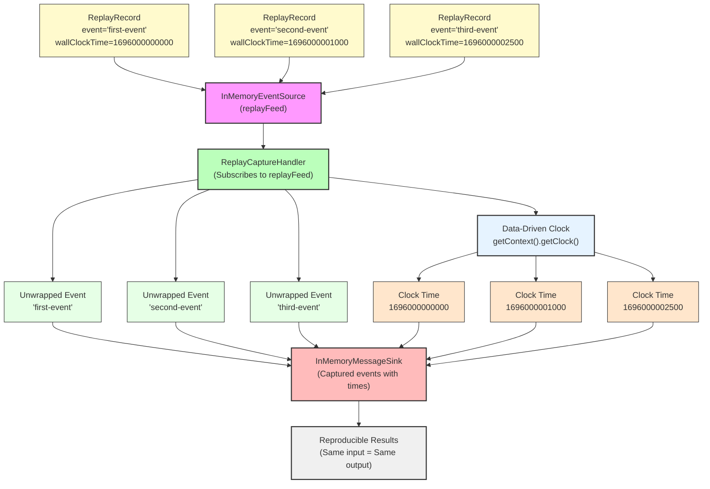

# How To: Deterministic Replay with ReplayRecord and Data-Driven Clock

**Mongoose project homepage:** https://telaminai.github.io/mongoose/

[](https://github.com/telaminai/mongoose-examples/actions/workflows/ci.yml)

This is a Maven project that demonstrates how to implement deterministic replay using ReplayRecord and the data-driven clock. The example shows how to:

- Create ReplayRecord objects with explicit wall-clock times
- Publish replay records through event sources for deterministic replay
- Use handlers that read deterministic time via getContext().getClock()
- Achieve reproducible behavior when replaying the same event stream
- Demonstrate event unwrapping (handlers receive the wrapped event, not ReplayRecord)

The example's main class:

- [ReplayExample](src/main/java/com/telamin/mongoose/example/howto/ReplayExample.java)

## Flow Diagram

The following diagram illustrates the deterministic replay flow:



Mongoose maven dependency:

```xml
<dependencies>
    <dependency>
        <groupId>com.telamin</groupId>
        <artifactId>mongoose</artifactId>
        <version>${mongoose.version}</version>
    </dependency>
</dependencies>
```

## What it demonstrates

- Creating ReplayRecord objects with explicit wall-clock timestamps
- Publishing replay records through InMemoryEventSource for deterministic replay
- Event unwrapping: handlers receive the wrapped event, not the ReplayRecord itself
- Data-driven clock: handlers read deterministic time via getContext().getClock()
- Reproducible behavior: same ReplayRecord stream produces identical results
- Out-of-order timestamp handling: events processed in publication order with original timestamps
- Replay scenarios: basic replay, time sequences, and reproducibility testing

## Prerequisites

- Java 21+
- Maven 3.8+
- Access to the com.telamin:mongoose dependency (installed locally or available in your Maven repositories)
    - If you are developing alongside the Mongoose repo, run `mvn -q install` in the Mongoose project first to install
      it to your local repository, and ensure the version in this example's pom.xml (<mongoose.version>) matches.

## Sample code

### Creating ReplayRecord Objects

```java
private static ReplayRecord createReplayRecord(String event, long wallClockTime) {
    ReplayRecord record = new ReplayRecord();
    record.setEvent(event);
    record.setWallClockTime(wallClockTime);
    return record;
}

// Usage
long baseTime = 1_696_000_000_000L; // epoch millis
ReplayRecord r1 = createReplayRecord("first-event", baseTime);
ReplayRecord r2 = createReplayRecord("second-event", baseTime + 1000);
ReplayRecord r3 = createReplayRecord("third-event", baseTime + 2500);
```

### Publishing Replay Records

```java
// Create event source for replay records
InMemoryEventSource<ReplayRecord> eventSource = new InMemoryEventSource<>();
eventSource.setName("replayFeed");

// Publish replay records with explicit timestamps
eventSource.offer(r1);
eventSource.offer(r2);
eventSource.offer(r3);
```

### Handler with Data-Driven Clock

```java
public static class ReplayCaptureHandler extends ObjectEventHandlerNode {
    private final String feedName;
    private MessageSink<String> sink;
    private int eventCount = 0;

    @Override
    public void start() {
        getContext().subscribeToNamedFeed(feedName);
    }

    @Override
    protected boolean handleEvent(Object event) {
        eventCount++;
        
        // Get the data-driven clock time (deterministic from ReplayRecord)
        long clockTime = getContext().getClock().getWallClockTime();
        
        // Create capture message
        String captureMessage = String.format("event[%d]=%s, clock_time=%d", 
            eventCount, event, clockTime);
        
        if (sink != null) {
            sink.accept(captureMessage);
        }
        
        return true;
    }
}
```

### Demonstrating Reproducibility

```java
private static void demonstrateReplayReproducibility(InMemoryEventSource<ReplayRecord> eventSource, InMemoryMessageSink sink) throws InterruptedException {
    // Create identical replay sequences
    ReplayRecord[] sequence = {
        createReplayRecord("reproducible-event-1", baseTime + 100),
        createReplayRecord("reproducible-event-2", baseTime + 200),
        createReplayRecord("reproducible-event-3", baseTime + 300)
    };
    
    // First run
    sink.getMessages().clear();
    for (ReplayRecord record : sequence) {
        eventSource.offer(record);
    }
    List<Object> firstRun = List.copyOf(sink.getMessages());
    
    // Second run (identical)
    sink.getMessages().clear();
    for (ReplayRecord record : sequence) {
        eventSource.offer(record);
    }
    List<Object> secondRun = List.copyOf(sink.getMessages());
    
    // Verify reproducibility
    boolean identical = firstRun.equals(secondRun);
    System.out.println("Replay runs are identical: " + identical);
}
```

## Running the example

From the project root:

```bash
cd how-to/replay
mvn clean compile exec:java -Dexec.mainClass="com.telamin.mongoose.example.howto.ReplayExample"
```

Expected output:
```
Replay Example Started
Demonstrating deterministic replay with ReplayRecord...
ReplayCaptureHandler subscribed to feed: replayFeed

=== Basic Replay Demo ===
Publishing replay records with explicit timestamps...
Captured: event[1]=first-event, clock_time=1696000000000
Captured: event[2]=second-event, clock_time=1696000001000
Captured: event[3]=third-event, clock_time=1696000002500
Captured events:
event[1]=first-event, clock_time=1696000000000
event[2]=second-event, clock_time=1696000001000
event[3]=third-event, clock_time=1696000002500

=== Time Sequence Replay Demo ===
Publishing events with out-of-order timestamps...
Captured: event[4]=event-at-T+3000, clock_time=1700000003000
Captured: event[5]=event-at-T+1000, clock_time=1700000001000
Captured: event[6]=event-at-T+5000, clock_time=1700000005000
Captured: event[7]=event-at-T+2000, clock_time=1700000002000
Captured: event[8]=event-at-T+0, clock_time=1700000000000

=== Replay Reproducibility Demo ===
First replay run:
  event[1]=reproducible-event-1, clock_time=1650000000100
  event[2]=reproducible-event-2, clock_time=1650000000200
  event[3]=reproducible-event-3, clock_time=1650000000300
Second replay run (should be identical):
  event[1]=reproducible-event-1, clock_time=1650000000100
  event[2]=reproducible-event-2, clock_time=1650000000200
  event[3]=reproducible-event-3, clock_time=1650000000300
Replay runs are identical: true

Replay Example Completed
```

## Key concepts

- **ReplayRecord**: Container for events with explicit wall-clock timestamps
- **Data-Driven Clock**: getContext().getClock() returns deterministic time from ReplayRecord
- **Event Unwrapping**: Handlers receive the wrapped event, not the ReplayRecord itself
- **Deterministic Replay**: Same ReplayRecord stream produces identical results
- **Reproducible Testing**: Critical for testing and offline analysis
- **Time Independence**: Processing order vs. timestamp order can differ
- **Event-to-Invocation Strategy**: Framework handles ReplayRecord processing automatically

## Why use deterministic replay?

- **Testing**: Reproducible test scenarios with controlled timing
- **Debugging**: Replay production scenarios with exact timing
- **Analysis**: Offline analysis with consistent time progression
- **Validation**: Verify system behavior under specific timing conditions
- **Simulation**: Model time-dependent scenarios accurately

## Related documentation

- Related how-to guide: [Deterministic replay with ReplayRecord and data-driven clock](https://telaminai.github.io/mongoose/how-to/how-to-replay/)
- [Event Processing](https://telaminai.github.io/mongoose/reference/event-processing/)
- [Testing Strategies](https://telaminai.github.io/mongoose/reference/testing/)