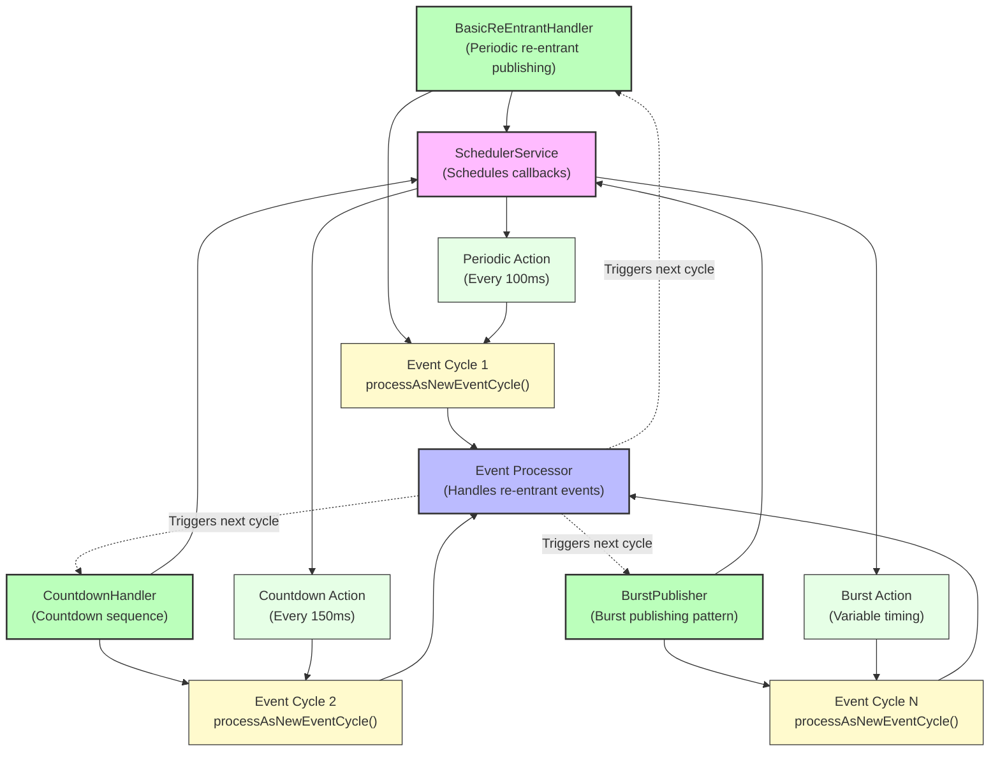

# How To: Re-entrant Publishing with processAsNewEventCycle and SchedulerService

**Mongoose project homepage:** https://telaminai.github.io/mongoose/

[](https://github.com/telaminai/mongoose-examples/actions/workflows/ci.yml)

This is a Maven project that demonstrates re-entrant publishing with processAsNewEventCycle and SchedulerService. The example shows how to:

- Use getContext().processAsNewEventCycle() to inject events back into the processing cycle
- Combine SchedulerService with processAsNewEventCycle for periodic re-entry
- Create self-sustaining event loops within processors
- Control re-entrant publishing with termination conditions
- Implement different patterns: periodic publishing, countdown sequences, and burst generation

The example's main class:

- [SchedulerProcessAsNewEventCycleExample](src/main/java/com/telamin/mongoose/example/howto/SchedulerProcessAsNewEventCycleExample.java)

## Flow Diagram

The following diagram illustrates the re-entrant publishing flow:



Mongoose maven dependency:

```xml
<dependencies>
    <dependency>
        <groupId>com.telamin</groupId>
        <artifactId>mongoose</artifactId>
        <version>${mongoose.version}</version>
    </dependency>
</dependencies>
```

## What it demonstrates

- Using getContext().processAsNewEventCycle() to inject events into the processing cycle
- Combining SchedulerService callbacks with processAsNewEventCycle for timed re-entry
- Creating self-sustaining event loops that continue until termination conditions are met
- Different re-entrant patterns: periodic publishing, countdown sequences, and burst generation
- Proper termination handling to prevent infinite loops in tests and demos
- Event flow where re-entrant events are processed just like external inputs

## Prerequisites

- Java 21+
- Maven 3.8+
- Access to the com.telamin:mongoose dependency (installed locally or available in your Maven repositories)
    - If you are developing alongside the Mongoose repo, run `mvn -q install` in the Mongoose project first to install
      it to your local repository, and ensure the version in this example's pom.xml (<mongoose.version>) matches.

## Sample code

### Basic Re-entrant Publishing

```java
public static class BasicReEntrantHandler extends ObjectEventHandlerNode {
    private SchedulerService schedulerService;
    private int count = 0;
    private int maxCount = 10;
    private long republishWaitMillis = 100;

    @ServiceRegistered
    public void schedulerRegistered(SchedulerService schedulerService, String name) {
        this.schedulerService = schedulerService;
    }

    @Override
    public void start() {
        publishReEntrantEvent();
    }

    private void publishReEntrantEvent() {
        // 1) Publish a new event into the processing cycle
        String eventMessage = "Re-Entrant Event [" + count + "]";
        getContext().processAsNewEventCycle(eventMessage);
        count++;

        // 2) Check termination condition
        if (count >= maxCount) {
            return; // stop scheduling further events
        }

        // 3) Schedule the next callback that will again re-enter the cycle
        schedulerService.scheduleAfterDelay(republishWaitMillis, this::publishReEntrantEvent);
    }

    @Override
    protected boolean handleEvent(Object event) {
        // Event is observed as if it came from outside
        System.out.println("BasicReEntrantHandler received: " + event);
        return true;
    }
}
```

### Countdown Sequence Pattern

```java
public static class CountdownHandler extends ObjectEventHandlerNode {
    private SchedulerService schedulerService;
    private int currentValue;
    private int startValue = 10;
    private long delayMillis = 200;

    @Override
    public void start() {
        currentValue = startValue;
        publishCountdownEvent();
    }

    private void publishCountdownEvent() {
        String eventMessage = "Countdown: " + currentValue;
        getContext().processAsNewEventCycle(eventMessage);
        
        currentValue--;
        
        if (currentValue >= 0) {
            // Schedule next countdown event
            schedulerService.scheduleAfterDelay(delayMillis, this::publishCountdownEvent);
        } else {
            // Countdown finished, publish final event
            getContext().processAsNewEventCycle("Countdown: BLAST OFF! 🚀");
        }
    }
}
```

### Burst Publishing Pattern

```java
public static class BurstPublisher extends ObjectEventHandlerNode {
    private SchedulerService schedulerService;
    private int burstSize = 5;
    private int burstCount = 3;
    private long burstDelayMillis = 500;
    private long eventDelayMillis = 100;
    
    private int currentBurst = 0;
    private int currentEventInBurst = 0;

    @Override
    public void start() {
        currentBurst = 0;
        publishNextBurst();
    }

    private void publishNextBurst() {
        if (currentBurst >= burstCount) {
            return; // All bursts completed
        }

        currentBurst++;
        currentEventInBurst = 0;
        publishNextEventInBurst();
    }

    private void publishNextEventInBurst() {
        currentEventInBurst++;
        String eventMessage = "Burst " + currentBurst + " Event " + currentEventInBurst;
        getContext().processAsNewEventCycle(eventMessage);

        if (currentEventInBurst < burstSize) {
            // Schedule next event in current burst
            schedulerService.scheduleAfterDelay(eventDelayMillis, this::publishNextEventInBurst);
        } else {
            // Current burst complete, schedule next burst
            schedulerService.scheduleAfterDelay(burstDelayMillis, this::publishNextBurst);
        }
    }
}
```

## Running the example

From the project root:

```bash
cd how-to/scheduler-processAsNewEventCycle
mvn clean compile exec:java -Dexec.mainClass="com.telamin.mongoose.example.howto.SchedulerProcessAsNewEventCycleExample"
```

Expected output:
```
Scheduler processAsNewEventCycle Example Started
Demonstrating re-entrant publishing patterns...

Demonstrating re-entrant publishing scenarios...

=== Basic Re-Entrant Publishing Demo ===
Starting basic re-entrant handler...
SchedulerService registered in BasicReEntrantHandler
BasicReEntrantHandler started, beginning re-entrant publishing...
Published: Re-Entrant Event [0]
BasicReEntrantHandler received: Re-Entrant Event [0]
Published: Re-Entrant Event [1]
BasicReEntrantHandler received: Re-Entrant Event [1]
...
Basic re-entrant completed. Final count: 5

=== Countdown Sequence Demo ===
Starting countdown from 10...
CountdownHandler: Countdown: 10
CountdownHandler: Countdown: 9
CountdownHandler: Countdown: 8
...
CountdownHandler: Countdown: 0
CountdownHandler: Countdown: BLAST OFF! 🚀
Countdown completed.

=== Burst Publishing Demo ===
Starting burst publishing...
Starting burst 1 of 2
BurstPublisher: Burst 1 Event 1
BurstPublisher: Burst 1 Event 2
BurstPublisher: Burst 1 Event 3
Starting burst 2 of 2
BurstPublisher: Burst 2 Event 1
BurstPublisher: Burst 2 Event 2
BurstPublisher: Burst 2 Event 3
All bursts completed!
Burst publishing completed.
```

## Key concepts

- **processAsNewEventCycle()**: Injects events back into the processing cycle as if they came from external sources
- **Re-entrant Publishing**: Handlers can publish events that they themselves will process
- **Scheduled Callbacks**: Use SchedulerService to create timed re-entry points
- **Self-sustaining Loops**: Event loops that continue until termination conditions are met
- **Termination Control**: Important to prevent infinite loops in production and test scenarios
- **Event Flow**: Re-entrant events flow through the same mapping and dispatching path as external events

## Related documentation

- Related how-to guide: [Re-entrant publishing with processAsNewEventCycle and SchedulerService](https://telaminai.github.io/mongoose/how-to/how-to-scheduler-processAsNewEventCycle/)
- [SchedulerService API](https://telaminai.github.io/mongoose/reference/scheduler-service/)
- [Event Processing](https://telaminai.github.io/mongoose/reference/event-processing/)
- [NodeContext API](https://telaminai.github.io/mongoose/reference/node-context/)