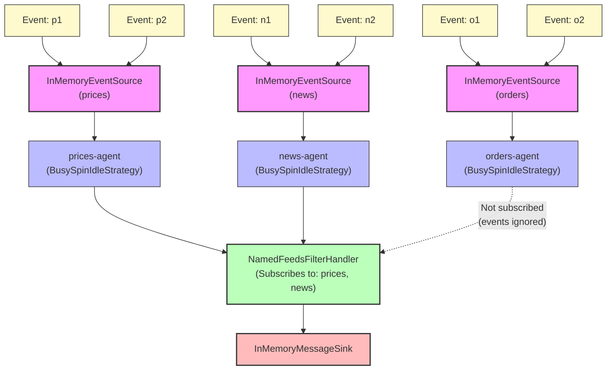

# How To: Subscribing to Named Event Feeds

**Mongoose project homepage:** https://telaminai.github.io/mongoose/

[](https://github.com/telaminai/mongoose-examples/actions/workflows/ci.yml)

This is a Maven project that demonstrates how to subscribe to specific named EventFeeds and ignore others. The example shows how to:

- Name each EventFeed via EventFeedConfig.name("...")
- Subscribe to selected feed names from a processor using getContext().subscribeToNamedFeed("...")
- Forward only events from the selected feeds to a sink
- Ignore events from feeds that are not subscribed to

The example's main class:

- [SubscribingToNamedEventFeedsExample](src/main/java/com/telamin/mongoose/example/howto/SubscribingToNamedEventFeedsExample.java)

## Flow Diagram

The following diagram illustrates the flow of events through the system:



Mongoose maven dependency:

```xml
<dependencies>
    <dependency>
        <groupId>com.telamin</groupId>
        <artifactId>mongoose</artifactId>
        <version>${mongoose.version}</version>
    </dependency>
</dependencies>
```

## What it demonstrates

- Creating multiple named in-memory event sources
- Implementing a filter handler that only processes events from specific named feeds
- Subscribing to specific named feeds during handler initialization using getContext().subscribeToNamedFeed()
- Configuring multiple feed agents with their own idle strategies
- Using an in-memory sink to collect and display the filtered messages
- Demonstrating that events from non-subscribed feeds are ignored

## Prerequisites

- Java 21+
- Maven 3.8+
- Access to the com.telamin:mongoose dependency (installed locally or available in your Maven repositories)
    - If you are developing alongside the Mongoose repo, run `mvn -q install` in the Mongoose project first to install
      it to your local repository, and ensure the version in this example's pom.xml (<mongoose.version>) matches.

## Sample code

### Filter Handler that Subscribes to Specific Feed Names

The sample below shows how to create a filter handler that only processes events from specific named feeds:

```java
public class NamedFeedsFilterHandler extends ObjectEventHandlerNode {

    private final Set<String> acceptedFeedNames;
    private MessageSink<String> sink;

    public NamedFeedsFilterHandler(Set<String> acceptedFeedNames) {
        this.acceptedFeedNames = acceptedFeedNames;
    }

    @ServiceRegistered
    public void wire(MessageSink<String> sink, String name) {
        this.sink = sink;
    }

    @Override
    public void start() {
        // Subscribe to the selected feed names at startup
        acceptedFeedNames.forEach(feedName -> getContext().subscribeToNamedFeed(feedName));
    }

    @Override
    protected boolean handleEvent(Object event) {
        if (sink == null || event == null) {
            return true;
        }
        // In this example, the feed payload is a String, so just forward it
        if (event instanceof String payload) {
            sink.accept(payload);
        }
        return true;
    }
}
```

Key points:
- The handler subscribes to specific feed names in the `start()` method using `getContext().subscribeToNamedFeed(feedName)`
- Only events from subscribed feeds will be delivered to the `handleEvent()` method
- Events from non-subscribed feeds are automatically ignored by the Mongoose framework

### Main Application Setup

The main application sets up three named feeds but only subscribes to two of them:

```java
// Create three named in-memory event sources
InMemoryEventSource<String> prices = new InMemoryEventSource<>();
InMemoryEventSource<String> orders = new InMemoryEventSource<>();
InMemoryEventSource<String> news = new InMemoryEventSource<>();

// Create processor that only forwards events from feeds: prices, news
NamedFeedsFilterHandler filterHandler = new NamedFeedsFilterHandler(Set.of("prices", "news"));

// Build EventFeed configs with names
EventFeedConfig<?> pricesFeed = EventFeedConfig.builder()
        .instance(prices)
        .name("prices")
        .agent("prices-agent", new BusySpinIdleStrategy())
        .build();

EventFeedConfig<?> ordersFeed = EventFeedConfig.builder()
        .instance(orders)
        .name("orders")
        .agent("orders-agent", new BusySpinIdleStrategy())
        .build();

EventFeedConfig<?> newsFeed = EventFeedConfig.builder()
        .instance(news)
        .name("news")
        .agent("news-agent", new BusySpinIdleStrategy())
        .build();

// Publish events to all feeds
prices.offer("p1");
prices.offer("p2");
orders.offer("o1"); // This will be ignored
orders.offer("o2"); // This will be ignored
news.offer("n1");
news.offer("n2");

// Only events from "prices" and "news" feeds will be processed
```

## Build

From this project directory:

- Build: `./mvnw -q package`

## Run

There are two common ways to run the example:

1) Via your IDE:

- Set the main class to `com.telamin.mongoose.example.howto.SubscribingToNamedEventFeedsExample`

2) Via the JAR:

- Build: `./mvnw -q package`
- Run: `java -jar target/subscribing-to-named-event-feeds-1.0-SNAPSHOT.jar`

Expected output:

```
Publishing events to all three feeds...

Received messages (should only include prices and news, not orders):
p1
p2
n1
n2

Expected: p1, p2, n1, n2 (orders o1, o2 are ignored)
Actual count: 4 messages
```

Note that events from the "orders" feed (o1, o2) are not included in the output because the filter handler only subscribes to the "prices" and "news" feeds.

## Key Concepts

### Named Event Feeds

- Event feeds are given names using `EventFeedConfig.builder().name("feedName")`
- Multiple feeds can have different names and run on different agents
- Feed names are used for selective subscription

### Selective Subscription

- Processors can subscribe to specific feeds by name using `getContext().subscribeToNamedFeed("feedName")`
- Only events from subscribed feeds are delivered to the processor
- Non-subscribed feeds are automatically ignored
- Subscription happens during the `start()` lifecycle method

### Event Flow Control

- This pattern allows for fine-grained control over which events reach which processors
- Useful for building systems that need to handle different types of events from different sources
- Enables event routing and filtering at the infrastructure level

## Notes

- This example demonstrates selective event processing based on feed names, which is useful for building systems that need to handle different types of events from different sources.
- Each feed has its own agent thread and idle strategy, allowing for independent configuration of how each feed processes events.
- The filter handler subscribes to specific named feeds during its start() method, showing how to dynamically configure subscriptions.
- The example uses BusySpinIdleStrategy for very low latency. For general usage, consider a less CPU-intensive idle strategy.
- Events from non-subscribed feeds are ignored at the framework level, not in user code.

## Links

- Mongoose GitHub repository: https://github.com/telaminai/mongoose
- Mongoose project homepage: https://telaminai.github.io/mongoose/
- Example source in this project: [SubscribingToNamedEventFeedsExample](src/main/java/com/telamin/mongoose/example/howto/SubscribingToNamedEventFeedsExample.java)
- Related how-to guide: [How to subscribe to specific named EventFeeds](https://telaminai.github.io/mongoose/docs/how-to/how-to-subscribing-to-named-event-feeds/)