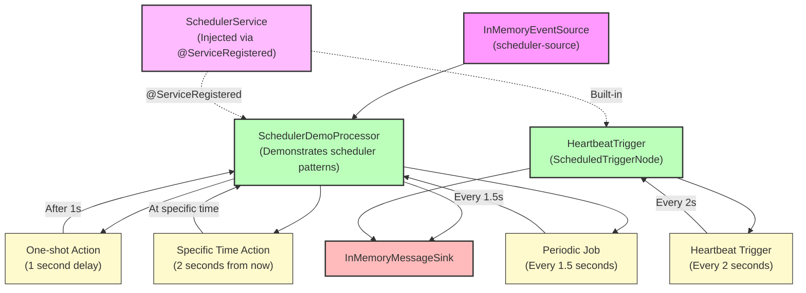

# How To: Using the Scheduler Service

**Mongoose project homepage:** https://telaminai.github.io/mongoose/

[](https://github.com/telaminai/mongoose-examples/actions/workflows/ci.yml)

This is a Maven project that demonstrates how to use the built-in SchedulerService in Mongoose server for delayed actions and periodic jobs. The example shows how to:

- Inject SchedulerService into processors using @ServiceRegistered
- Schedule one-shot delayed actions using scheduleAfterDelay()
- Schedule actions at specific times using scheduleAtTime()
- Create periodic jobs using the rescheduling pattern
- Use ScheduledTriggerNode for triggering event cycles
- Utilize time helpers (milliTime, microTime, nanoTime)

The example's main class:

- [UsingTheSchedulerServiceExample](src/main/java/com/telamin/mongoose/example/howto/UsingTheSchedulerServiceExample.java)

## Flow Diagram

The following diagram illustrates the scheduler service patterns:



Mongoose maven dependency:

```xml
<dependencies>
    <dependency>
        <groupId>com.telamin</groupId>
        <artifactId>mongoose</artifactId>
        <version>${mongoose.version}</version>
    </dependency>
</dependencies>
```

## What it demonstrates

- Injecting SchedulerService into processors using @ServiceRegistered annotation
- One-shot delayed actions with scheduleAfterDelay()
- Scheduling actions at specific wall-clock times with scheduleAtTime()
- Implementing periodic jobs using the rescheduling pattern
- Using ScheduledTriggerNode for event cycle triggers
- Time helpers for consistent time measurement
- Proper cancellation patterns using volatile flags
- Threading considerations for scheduler actions

## Prerequisites

- Java 21+
- Maven 3.8+
- Access to the com.telamin:mongoose dependency (installed locally or available in your Maven repositories)
    - If you are developing alongside the Mongoose repo, run `mvn -q install` in the Mongoose project first to install
      it to your local repository, and ensure the version in this example's pom.xml (<mongoose.version>) matches.

## Sample code

### Injecting SchedulerService

```java
public static class SchedulerDemoProcessor extends ObjectEventHandlerNode {
    private SchedulerService scheduler;
    
    @ServiceRegistered
    public void scheduler(SchedulerService scheduler) {
        this.scheduler = scheduler;
        System.out.println("SchedulerService injected into processor");
    }
}
```

### One-shot Delayed Action

```java
// Schedule action to run in 1 second
scheduler.scheduleAfterDelay(1000, () -> {
    System.out.println("One-shot action executed! Current time: " + scheduler.milliTime());
});
```

### Scheduling at Specific Time

```java
// Schedule action to run at specific wall-clock time
long runAt = scheduler.milliTime() + 2000; // 2 seconds from now
scheduler.scheduleAtTime(runAt, () -> {
    System.out.println("Scheduled time action executed! Time: " + scheduler.milliTime());
});
```

### Periodic Job with Rescheduling Pattern

```java
private volatile boolean periodicJobRunning = true;

private void schedulePeriodicJob(long periodMs) {
    scheduler.scheduleAfterDelay(periodMs, () -> {
        if (!periodicJobRunning) {
            System.out.println("Periodic job stopped");
            return;
        }
        
        // Do periodic work
        System.out.println("Periodic job execution at time: " + scheduler.milliTime());
        
        // Reschedule for next execution
        schedulePeriodicJob(periodMs);
    });
}
```

### Using ScheduledTriggerNode

```java
public static class HeartbeatTrigger extends ScheduledTriggerNode {
    private volatile boolean heartbeatRunning = true;
    
    @Override
    public void start() {
        scheduleNextHeartbeat();
    }
    
    @Override
    public void onTrigger() {
        if (!heartbeatRunning) return;
        
        System.out.println("💓 Heartbeat triggered");
        scheduleNextHeartbeat();
    }
    
    private void scheduleNextHeartbeat() {
        if (heartbeatRunning) {
            triggerAfterDelay(2000); // Every 2 seconds
        }
    }
}
```

## Running the example

From the project root:

```bash
cd how-to/using-the-scheduler-service
mvn clean compile exec:java -Dexec.mainClass="com.telamin.mongoose.example.howto.UsingTheSchedulerServiceExample"
```

Expected output:
```
Scheduler Service Example Started
Demonstrating various scheduler patterns...
SchedulerService injected into processor
Starting heartbeat trigger...

=== Scheduler Patterns Demo ===
1. Scheduling one-shot action in 1 second...
2. Scheduling action at specific time: 1234567892000
3. Starting periodic job (every 1.5 seconds)...
4. Time helpers:
   milliTime(): 1234567890000
   microTime(): 1234567890000000
   nanoTime(): 1234567890000000000

   One-shot action executed! Current time: 1234567891000
   Scheduled time action executed! Time: 1234567892000
   Periodic job execution #1 at time: 1234567891500
💓 Heartbeat #1 triggered at: 1234567892000
   Periodic job execution #2 at time: 1234567893000
💓 Heartbeat #2 triggered at: 1234567894000
...
```

## Key concepts

- **Service Injection**: SchedulerService is automatically injected into processors and services
- **One-shot Actions**: Use scheduleAfterDelay() or scheduleAtTime() for single execution
- **Periodic Jobs**: Implement using rescheduling pattern within the action
- **Threading Model**: Actions execute on scheduler's agent thread, not processor thread
- **Cancellation**: Use volatile flags to stop periodic jobs gracefully
- **Time Helpers**: Use scheduler's time methods for consistent time measurement
- **ScheduledTriggerNode**: Convenient base class for triggering event cycles

## Related documentation

- Related how-to guide: [Using the Scheduler Service](https://telaminai.github.io/mongoose/how-to/how-to-using-the-scheduler-service/)
- [SchedulerService API](https://telaminai.github.io/mongoose/reference/scheduler-service/)
- [Service Registration](https://telaminai.github.io/mongoose/reference/service-registration/)