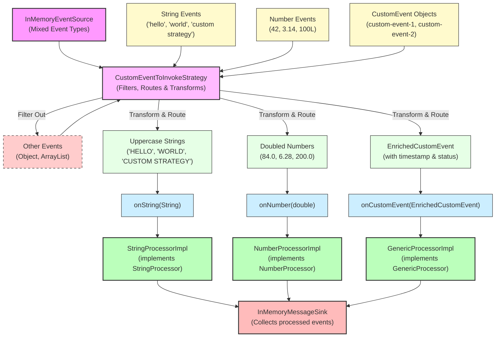

# How To: Writing a Custom EventToInvokeStrategy

**Mongoose project homepage:** https://telaminai.github.io/mongoose/

[](https://github.com/telaminai/mongoose-examples/actions/workflows/ci.yml)

This is a Maven project that demonstrates how to write custom EventToInvokeStrategy implementations to control how events are dispatched from queues to StaticEventProcessor instances. The example shows how to:

- Create custom EventToInvokeStrategy by extending AbstractEventToInvocationStrategy
- Filter which processors can receive events using isValidTarget()
- Transform events before delivery using dispatchEvent()
- Use strongly-typed callbacks instead of generic onEvent()
- Register custom strategies via MongooseServerConfig
- Implement different strategy patterns: filtering, transformation, and routing

The example's main class:

- [WritingCustomEventToInvokeStrategyExample](src/main/java/com/telamin/mongoose/example/howto/WritingCustomEventToInvokeStrategyExample.java)

## Flow Diagram

The following diagram illustrates the custom event dispatch strategy:



Mongoose maven dependency:

```xml
<dependencies>
    <dependency>
        <groupId>com.telamin</groupId>
        <artifactId>mongoose</artifactId>
        <version>${mongoose.version}</version>
    </dependency>
</dependencies>
```

## What it demonstrates

- Creating custom EventToInvokeStrategy by extending AbstractEventToInvocationStrategy
- Implementing event filtering using isValidTarget() to accept only specific processor types
- Transforming events before delivery (uppercase strings, doubled numbers, enriched objects)
- Using strongly-typed callbacks (onString, onNumber, onCustomEvent) instead of generic onEvent
- Registering custom strategies via MongooseServerConfig.onEventInvokeStrategy()
- Event routing based on both event type and processor type
- Centralized dispatch logic that reduces boilerplate in individual processors

## Prerequisites

- Java 21+
- Maven 3.8+
- Access to the com.telamin:mongoose dependency (installed locally or available in your Maven repositories)
    - If you are developing alongside the Mongoose repo, run `mvn -q install` in the Mongoose project first to install
      it to your local repository, and ensure the version in this example's pom.xml (<mongoose.version>) matches.

## Sample code

### Custom EventToInvokeStrategy Implementation

```java
public static class CustomEventToInvokeStrategy extends AbstractEventToInvocationStrategy {

    @Override
    protected void dispatchEvent(Object event, StaticEventProcessor eventProcessor) {
        // Route String events to StringProcessor with transformation
        if (event instanceof String str && eventProcessor instanceof StringProcessor stringProc) {
            // Transform: convert to uppercase
            stringProc.onString(str.toUpperCase());
            return;
        }

        // Route Number events to NumberProcessor with transformation
        if (event instanceof Number num && eventProcessor instanceof NumberProcessor numberProc) {
            // Transform: convert to double and multiply by 2
            numberProc.onNumber(num.doubleValue() * 2.0);
            return;
        }

        // Route CustomEvent to GenericProcessor with transformation
        if (event instanceof CustomEvent customEvent && eventProcessor instanceof GenericProcessor genericProc) {
            // Transform: create enriched event
            EnrichedCustomEvent enriched = new EnrichedCustomEvent(
                customEvent.getName(),
                customEvent.getData(),
                System.currentTimeMillis(),
                "PROCESSED"
            );
            genericProc.onCustomEvent(enriched);
            return;
        }

        // Events that don't match any processor are silently filtered out
    }

    @Override
    protected boolean isValidTarget(StaticEventProcessor eventProcessor) {
        // Only accept processors that implement our marker interfaces
        return eventProcessor instanceof StringProcessor ||
               eventProcessor instanceof NumberProcessor ||
               eventProcessor instanceof GenericProcessor;
    }
}
```

### Marker Interfaces for Strongly-Typed Callbacks

```java
// Marker interface for processors that handle String events
public interface StringProcessor {
    void onString(String str);
}

// Marker interface for processors that handle Number events
public interface NumberProcessor {
    void onNumber(double number);
}

// Marker interface for processors that handle CustomEvent events
public interface GenericProcessor {
    void onCustomEvent(EnrichedCustomEvent event);
}
```

### Processor Implementation with Strongly-Typed Callback

```java
public static class StringProcessorImpl extends ObjectEventHandlerNode implements StringProcessor {
    private volatile int processedCount = 0;
    private final List<String> processedStrings = new ArrayList<>();

    @Override
    public void start() {
        getContext().subscribeToNamedFeed("custom-strategy-feed");
    }

    @Override
    public void onString(String str) {
        processedCount++;
        processedStrings.add(str);
        System.out.println("StringProcessor received: " + str);
    }

    @Override
    protected boolean handleEvent(Object event) {
        // This should not be called due to our custom strategy
        System.out.println("StringProcessor.handleEvent called with: " + event);
        return true;
    }
}
```

### Registering Custom Strategy

```java
MongooseServerConfig serverConfig = MongooseServerConfig.builder()
    // Register custom strategy for event dispatch
    .onEventInvokeStrategy(CustomEventToInvokeStrategy::new)
    
    .addProcessorGroup(EventProcessorGroupConfig.builder()
        .agentName("custom-strategy-agent")
        .put("string-processor", new EventProcessorConfig(stringProcessor))
        .put("number-processor", new EventProcessorConfig(numberProcessor))
        .put("generic-processor", new EventProcessorConfig(genericProcessor))
        .build())
    .build();
```

## Running the example

From the project root:

```bash
cd how-to/writing-a-custom-event-to-invoke-strategy
mvn clean compile exec:java -Dexec.mainClass="com.telamin.mongoose.example.howto.WritingCustomEventToInvokeStrategyExample"
```

Expected output:
```
Writing Custom EventToInvokeStrategy Example Started
Demonstrating custom event dispatch strategies...

Server started with custom EventToInvokeStrategy

Publishing different types of events...
Published various event types:
  - String events: 3
  - Number events: 3
  - Custom events: 2
  - Other events: 2 (should be filtered out)

StringProcessor received: HELLO
StringProcessor received: WORLD
StringProcessor received: CUSTOM STRATEGY
NumberProcessor received: 84.0
NumberProcessor received: 6.28
NumberProcessor received: 200.0
GenericProcessor received: EnrichedCustomEvent{name='custom-event-1', data='data1', timestamp=1234567890123, status='PROCESSED'}
GenericProcessor received: EnrichedCustomEvent{name='custom-event-2', data='data2', timestamp=1234567890124, status='PROCESSED'}

Processing Results:
String Processor:
  - Events processed: 3
  - Processed strings: [HELLO, WORLD, CUSTOM STRATEGY]
Number Processor:
  - Events processed: 3
  - Processed numbers: [84.0, 6.28, 200.0]
Generic Processor:
  - Events processed: 2
  - Processed events: [EnrichedCustomEvent{...}, EnrichedCustomEvent{...}]
Total messages in sink: 8

Custom Strategy Benefits:
  - Strongly-typed event callbacks
  - Event filtering and routing
  - Event transformation before delivery
  - Centralized dispatch logic
```

## Key concepts

- **EventToInvokeStrategy**: Interface that controls how events are dispatched to processors
- **AbstractEventToInvocationStrategy**: Convenience base class that handles processor registration and context management
- **dispatchEvent()**: Method where custom routing and transformation logic is implemented
- **isValidTarget()**: Method that filters which processors can receive events
- **Marker Interfaces**: Interfaces that processors implement to receive strongly-typed callbacks
- **Event Transformation**: Modifying events before delivery (uppercase, doubling, enrichment)
- **Event Filtering**: Silently dropping events that don't match any processor
- **Strongly-Typed Callbacks**: Using specific method signatures instead of generic onEvent()

## Benefits and use cases

### Benefits:
- **Type Safety**: Strongly-typed callbacks reduce casting and improve compile-time safety
- **Centralized Logic**: Event routing and transformation logic is centralized in the strategy
- **Reduced Boilerplate**: Processors don't need to handle type checking and casting
- **Flexible Routing**: Events can be routed to different processors based on complex criteria
- **Event Transformation**: Events can be modified or enriched before delivery
- **Event Filtering**: Unwanted events can be filtered out at the strategy level

### Use Cases:
- **Event Routing**: Route different event types to specialized processors
- **Data Transformation**: Convert events to different formats before processing
- **Event Enrichment**: Add metadata or context to events
- **Legacy Integration**: Adapt old event formats to new processor interfaces
- **Performance Optimization**: Pre-filter events to reduce processing overhead
- **Protocol Translation**: Convert between different event protocols or formats

## Alternative patterns

### Filter-Only Strategy
```java
public static class FilterOnlyStrategy extends AbstractEventToInvocationStrategy {
    @Override
    protected void dispatchEvent(Object event, StaticEventProcessor eventProcessor) {
        // No transformation, just dispatch
        eventProcessor.onEvent(event);
    }

    @Override
    protected boolean isValidTarget(StaticEventProcessor eventProcessor) {
        // Only accept specific processor types
        return eventProcessor instanceof StringProcessor;
    }
}
```

### Normalizing Strategy
```java
public static class NormalizingStrategy extends AbstractEventToInvocationStrategy {
    @Override
    protected void dispatchEvent(Object event, StaticEventProcessor eventProcessor) {
        // Transform all events to a normalized format
        String normalizedEvent = "NORMALIZED: " + event.toString();
        eventProcessor.onEvent(normalizedEvent);
    }

    @Override
    protected boolean isValidTarget(StaticEventProcessor eventProcessor) {
        // Accept all processors
        return true;
    }
}
```

## Related documentation

- Related how-to guide: [Writing a custom EventToInvokeStrategy](https://telaminai.github.io/mongoose/how-to/how-to-writing-a-custom-event-to-invoke-strategy/)
- [EventToInvokeStrategy Interface](https://telaminai.github.io/mongoose/reference/event-to-invoke-strategy/)
- [AbstractEventToInvocationStrategy](https://telaminai.github.io/mongoose/reference/abstract-event-to-invocation-strategy/)
- [Event Processing](https://telaminai.github.io/mongoose/reference/event-processing/)