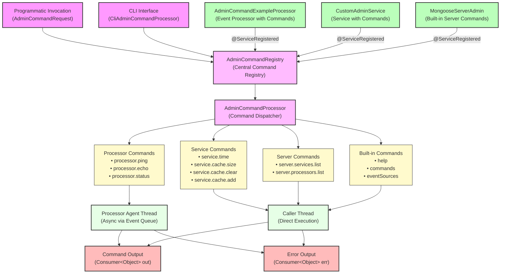

# How To: Writing an Admin Command

**Mongoose project homepage:** https://telaminai.github.io/mongoose/

[](https://github.com/telaminai/mongoose-examples/actions/workflows/ci.yml)

This is a Maven project that demonstrates how to write and use admin commands in Mongoose server applications. Admin commands are lightweight functions that you register at runtime and can invoke via a CLI or programmatically to inspect or control the system. The example shows how to:

- Register admin commands from processors using @ServiceRegistered
- Register admin commands from services using @ServiceRegistered  
- Wire admin infrastructure in MongooseServerConfig
- Invoke commands programmatically using AdminCommandRegistry
- Handle command arguments, output, and error channels
- Use built-in admin commands (help, commands, eventSources)
- Implement server control commands (list services/processors)
- Create custom operational commands (ping, echo, cache operations)

The example's main class:

- [WritingAnAdminCommandExample](src/main/java/com/telamin/mongoose/example/howto/WritingAnAdminCommandExample.java)

## Flow Diagram

The following diagram illustrates the admin command architecture:



## Key Components

### AdminCommandRegistry
Central registry for registering and invoking admin commands. Services and processors inject this via `@ServiceRegistered` to register their commands.

### AdminCommandProcessor  
Service that routes commands through the event flow and hosts built-in commands (help, commands, eventSources).

### Command Function Signature
All admin commands implement:
```java
void processAdminCommand(List<String> args, Consumer<OUT> out, Consumer<ERR> err)
```

### Execution Context
- **Processor commands**: Executed asynchronously on the processor's agent thread via event queue
- **Service commands**: Executed directly in the caller thread

## Running the Example

```bash
cd how-to/writing-an-admin-command
mvn clean compile exec:java -Dexec.mainClass="com.telamin.mongoose.example.howto.WritingAnAdminCommandExample"
```

## Expected Output

The example demonstrates various admin commands:

```
=== Writing an Admin Command Example ===
Server started with admin command support
Registering admin commands for processor: adminService
Registering admin commands for custom service

=== Demonstrating Admin Commands ===

1. Testing built-in 'commands' command:
Executing: commands 
  Output: Available commands: [commands, help, ?, eventSources, processor.ping, processor.echo, processor.status, service.time, service.cache.size, service.cache.clear, service.cache.add, server.services.list, server.processors.list]

2. Testing built-in 'help' command:
Executing: help 
  Output: Available commands: commands, help, ?, eventSources, processor.ping, processor.echo, processor.status, service.time, service.cache.size, service.cache.clear, service.cache.add, server.services.list, server.processors.list

3. Testing processor admin commands:
Executing: processor.ping 
  Output: pong from processor
Executing: processor.echo Hello from admin command
  Output: Echo from processor: Hello from admin command
Executing: processor.status 
  Output: Processor status - Events processed: 0, Last event: none

4. Testing service admin commands:
Executing: service.time 
  Output: Current time: 2024-01-15T10:30:45.123Z
Executing: service.cache.size 
  Output: Cache size: 5
Executing: service.cache.clear 
  Output: Cache cleared
Executing: service.cache.size 
  Output: Cache size: 0

5. Testing server admin commands:
Executing: server.services.list 
  Output: [adminService, serverAdmin, customService]
Executing: server.processors.list 
  Output: [exampleProcessorGroup]

=== Sending Events to Processor ===
Sent 4 events to processor

=== Processing Results ===
Messages received by sink: 4
  Processed: Hello World (count: 1)
  Processed: 42 (count: 2)
  Processed: Admin Command Example (count: 3)
  Processed: 3.14 (count: 4)

Server stopped
```

## Code Structure

### 1. Processor with Admin Commands
```java
public static class AdminCommandExampleProcessor extends ObjectEventHandlerNode {
    @ServiceRegistered
    public void registerAdmin(AdminCommandRegistry admin, String name) {
        admin.registerCommand("processor.ping", this::ping);
        admin.registerCommand("processor.echo", this::echo);
        admin.registerCommand("processor.status", this::status);
    }
    
    private void ping(List<String> args, Consumer<Object> out, Consumer<Object> err) {
        out.accept("pong from processor");
    }
}
```

### 2. Service with Admin Commands
```java
public static class CustomAdminService implements Lifecycle {
    private AdminCommandRegistry registry;
    
    @ServiceRegistered
    public void admin(AdminCommandRegistry registry) { 
        this.registry = registry; 
    }
    
    @Override
    public void start() {
        registry.registerCommand("service.time", this::getCurrentTime);
        registry.registerCommand("service.cache.size", this::getCacheSize);
    }
}
```

### 3. Wiring Admin Infrastructure
```java
// Admin registry/dispatcher service
ServiceConfig<AdminCommandRegistry> adminSvc = ServiceConfig.<AdminCommandRegistry>builder()
        .service(new AdminCommandProcessor())
        .serviceClass(AdminCommandRegistry.class)
        .name("adminService")
        .build();

// Server admin commands
ServiceConfig<?> serverAdmin = ServiceConfig.builder()
        .service(new MongooseServerAdmin())
        .name("serverAdmin")
        .build();

MongooseServerConfig config = MongooseServerConfig.builder()
        .addService(adminSvc)
        .addService(serverAdmin)
        .build();
```

### 4. Programmatic Command Invocation
```java
AdminCommandRequest request = new AdminCommandRequest();
request.setCommand("processor.ping");
request.setArguments(List.of());
request.setOutput(result -> System.out.println("Output: " + result));
request.setErrOutput(error -> System.err.println("Error: " + error));

registry.processAdminCommandRequest(request);
```

## Command Patterns

### Simple Commands
```java
private void ping(List<String> args, Consumer<Object> out, Consumer<Object> err) {
    out.accept("pong");
}
```

### Commands with Arguments
```java
private void echo(List<String> args, Consumer<Object> out, Consumer<Object> err) {
    if (args.size() <= 1) {
        err.accept("echo command requires arguments");
        return;
    }
    String message = String.join(" ", args.subList(1, args.size()));
    out.accept("Echo: " + message);
}
```

### Commands with State
```java
private void status(List<String> args, Consumer<Object> out, Consumer<Object> err) {
    out.accept("Events processed: " + processedCount + ", Last event: " + lastEvent);
}
```

## Best Practices

1. **Keep commands small and fast** - They should return quickly
2. **Validate arguments** - Use `err` consumer for helpful error messages
3. **Use descriptive names** - Prefer dash-separated names (e.g., `cache.clear`)
4. **Handle errors gracefully** - Don't throw exceptions unless exceptional
5. **Provide helpful output** - Use `out` for results, `err` for warnings/errors
6. **Consider execution context** - Processor commands run async, service commands run sync

## Optional CLI Interface

To enable interactive CLI, uncomment the CLI service in the configuration:

```java
ServiceConfig<?> cliSvc = ServiceConfig.builder()
        .service(new CliAdminCommandProcessor())
        .name("adminCli")
        .build();
```

Then you can type commands interactively:
- `commands` - List available commands
- `processor.ping` - Execute ping command
- `service.cache.size` - Check cache size

Mongoose maven dependency:

```xml
<dependencies>
    <dependency>
        <groupId>com.telamin</groupId>
        <artifactId>mongoose</artifactId>
        <version>1.0.3</version>
    </dependency>
</dependencies>
```

## Related Examples

- [Five Minute Tutorial](../../gettting-started/five-minute-tutorial) - Basic Mongoose setup
- [Injecting Config into a Processor](../injecting-config-into-a-processor) - Service injection patterns
- [Using the Scheduler Service](../using-the-scheduler-service) - Service lifecycle management