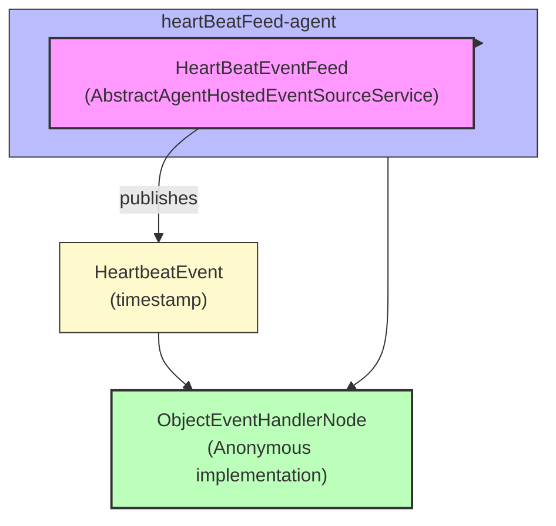

# Event Source Example

**Mongoose project homepage:** https://telaminai.github.io/mongoose/

[](https://github.com/telaminai/mongoose-examples/actions/workflows/ci.yml)

This is a Maven project that demonstrates how to create a custom event source by extending the `AbstractAgentHostedEventSourceService` class. The example shows how to:

- Create a custom agent-hosted event source service
- Configure the service with a specific agent and idle strategy
- Integrate the service into a Mongoose Server
- Process events generated by the service

The example's main class:

- [EventSourceExample](src/main/java/com/telamin/mongoose/example/eventsource/EventSourceExample.java)

## Flow Diagram

The following diagram illustrates the flow of events through the system:



Mongoose maven dependency:

```xml
<dependencies>
    <dependency>
        <groupId>com.telamin</groupId>
        <artifactId>mongoose</artifactId>
        <version>${mongoose.version}</version>
    </dependency>
</dependencies>
```

## What it demonstrates

- Creating a custom event source by extending `AbstractAgentHostedEventSourceService`
- Implementing the `doWork()` method to generate events at regular intervals
- Configuring an agent with a specific idle strategy for the event source
- Processing events in a simple handler
- Tracking and reporting message rates

## What is an Agent-Hosted Service?

An agent-hosted service in Mongoose is a service that runs on a dedicated agent thread. The `AbstractAgentHostedEventSourceService` is a base class that:

1. Provides the infrastructure for running a service on an agent thread
2. Handles the lifecycle of the service (start, stop, etc.)
3. Provides a mechanism for publishing events to subscribers
4. Calls the `doWork()` method periodically based on the agent's idle strategy

By extending this class, you can create custom event sources that generate events based on your specific requirements, without having to worry about the threading and lifecycle management details.

## Prerequisites

- Java 21+
- Maven 3.8+
- Access to the com.telamin:mongoose dependency (installed locally or available in your Maven repositories)
    - If you are developing alongside the Mongoose repo, run `mvn -q install` in the Mongoose project first to install
      it to your local repository, and ensure the version in this example's pom.xml (<mongoose.version>) matches.

## Sample code

### Custom Event Source

The sample below shows how to create a custom event source by extending `AbstractAgentHostedEventSourceService`:

```java
public class HeartBeatEventFeed extends AbstractAgentHostedEventSourceService<HeartbeatEvent> {

    @Getter
    @Setter
    private int publishIntervalNanos = 2_000_000_000;
    private final HeartbeatEvent heartbeatEvent = new HeartbeatEvent();
    private long publishTime = -1;

    // Add counters for message rate tracking
    private int messageCount = 0;
    private long lastPrintTime = System.currentTimeMillis();

    public HeartBeatEventFeed() {
        super("HeartBeatService2");
    }

    @Override
    public int doWork() throws Exception {
        long currentNanoTime = System.nanoTime();
        if (currentNanoTime - publishTime > publishIntervalNanos) {
            publishTime = currentNanoTime;
            heartbeatEvent.setTimestamp(System.nanoTime());
            output.publish(heartbeatEvent);

            // Increment message counter
            messageCount++;

            // Print rate every second
            long currentTime = System.currentTimeMillis();
            if (currentTime - lastPrintTime >= 1000) {  // Check if 1 second has passed
                System.out.printf("Heartbeat messages per second: %d%n", messageCount);
                messageCount = 0;
                lastPrintTime = currentTime;
            }
            return 1;
        }
        return 0;
    }
}
```

Key points:
- The class extends `AbstractAgentHostedEventSourceService<HeartbeatEvent>`, specifying the type of events it will publish
- The `doWork()` method is called periodically by the agent thread
- The method publishes a `HeartbeatEvent` at regular intervals (controlled by `publishIntervalNanos`)
- The method returns the number of events published (0 or 1)
- The class tracks and reports the message rate

### Event Structure

The `HeartbeatEvent` is a simple event class with a timestamp:

```java
@Getter
@Setter
@ToString
public class HeartbeatEvent {
    private long timestamp;

    public HeartbeatEvent() {
        timestamp = System.nanoTime();
    }

    public HeartbeatEvent(long timestamp) {
        this.timestamp = timestamp;
    }
}
```

### Main Application

The main application sets up the event source and a handler to process the events:

```java
public static void main(String[] args) {
    var handler = new ObjectEventHandlerNode() {
        @Override
        protected boolean handleEvent(Object event) {
            if (event instanceof HeartbeatEvent s) {
                System.out.println("Got event: " + s);
            }
            return true;
        }};
    
    // build the handler config
    var eventProcessorConfig = EventProcessorConfig.builder()
            .customHandler(handler)
            .name("heartBeat-handler")
            .build();

    // Build EventFeed configs with names
    EventFeedConfig<?> heartBeatFeed = EventFeedConfig.builder()
            .instance(new HeartBeatEventFeed())
            .name("heartbeatFeed")
            .agent("heartBeatFeed-agent", new SleepingMillisIdleStrategy())
            .broadcast(true)
            .build();

    // compose server from configs
    MongooseServerConfig mongooseServerConfig = MongooseServerConfig.builder()
            .addProcessor("processor-agent", eventProcessorConfig)
            .addEventFeed(heartBeatFeed)
            .build();

    // boot the MongooseServer
    MongooseServer.bootServer(mongooseServerConfig);
}
```

How it boots and runs:

- Create a simple handler that processes `HeartbeatEvent` objects and prints them
- Configure the event processor with this handler
- Create a `HeartBeatEventFeed` instance and configure it as an event feed with a specific agent and idle strategy
- Build a `MongooseServerConfig` that combines the processor and event feed
- Boot a `MongooseServer` with this configuration
- The server runs indefinitely, with the `HeartBeatEventFeed` generating events at regular intervals

## Build

From this project directory:

- Build: `./mvnw -q package`

## Run

There are two common ways to run the example:

1) Via your IDE:

- Set the main class to `com.telamin.mongoose.example.eventsource.EventSourceExample`

2) Via the JAR:

- Build: `./mvnw -q package`
- Run: `java -jar target/event-source-example-1.0-SNAPSHOT.jar`

Expected output:

```
Heartbeat messages published per second: 2
Event in: HeartbeatEvent(timestamp=21911548847125)
Heartbeat messages published per second: 1
Event in: HeartbeatEvent(timestamp=21913548920291)
Heartbeat messages published per second: 1
Event in: HeartbeatEvent(timestamp=21915548953958)
Heartbeat messages published per second: 1
Event in: HeartbeatEvent(timestamp=21917549757416)
...
```

The output shows:
- The heartbeat message rate (printed every second)
- The events received by the handler, including their timestamps

## Notes

- This example demonstrates how to create a custom event source that generates events at regular intervals, which is useful for monitoring, testing, or triggering periodic actions.
- The `AbstractAgentHostedEventSourceService` provides a convenient base class for creating custom event sources that run on dedicated agent threads.
- The `doWork()` method is called periodically by the agent thread, based on the agent's idle strategy.
- The example uses `SleepingMillisIdleStrategy` for the agent, which is suitable for this type of periodic event generation.
- The message rate tracking shows how to monitor the performance of the event source.

## Links

- Mongoose GitHub repository: https://github.com/telaminai/mongoose
- Mongoose project homepage: https://telaminai.github.io/mongoose/
- Example source in this project: [EventSourceExample](src/main/java/com/telamin/mongoose/example/eventsource/EventSourceExample.java)