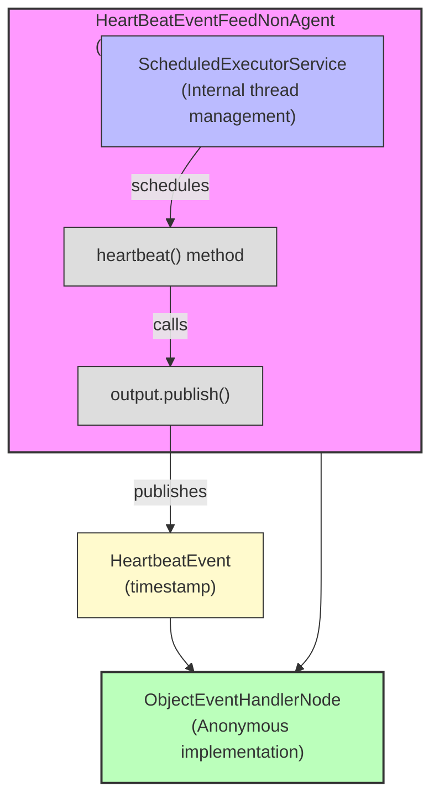

# Event Source Non-Agent Example

**Mongoose project homepage:** https://telaminai.github.io/mongoose/

[](https://github.com/telaminai/mongoose-examples/actions/workflows/ci.yml)

This is a Maven project that demonstrates how to create a custom event source by extending the `AbstractEventSourceService` class. The example shows how to:

- Create a custom non-agent event source service
- Manage your own thread scheduling using a ScheduledExecutorService
- Integrate the service into a Mongoose Server
- Process events generated by the service

The example's main class:

- [EventSourceExample](src/main/java/com/telamin/mongoose/example/eventsource/EventSourceExample.java)

## Flow Diagram

The following diagram illustrates the flow of events through the system:



Mongoose maven dependency:

```xml
<dependencies>
    <dependency>
        <groupId>com.telamin</groupId>
        <artifactId>mongoose</artifactId>
        <version>${mongoose.version}</version>
    </dependency>
</dependencies>
```

## What it demonstrates

- Creating a custom event source by extending `AbstractEventSourceService`
- Managing your own thread scheduling using a ScheduledExecutorService
- Configuring the event source without an agent
- Processing events in a simple handler

## What is a Non-Agent Service?

A non-agent service in Mongoose is a service that manages its own threading rather than relying on the Mongoose agent infrastructure. The `AbstractEventSourceService` is a base class that:

1. Handles the lifecycle of the service (start, stop, etc.)
2. Provides a mechanism for publishing events to subscribers
3. Allows you to implement your own threading strategy

By extending this class, you can create custom event sources that generate events based on your specific requirements, with complete control over the threading model. This is useful when:

- You need to integrate with existing thread pools or executors
- You want to use a specific scheduling mechanism
- You're receiving events from external callbacks
- You need more control over thread management than the agent model provides

## Prerequisites

- Java 21+
- Maven 3.8+
- Access to the com.telamin:mongoose dependency (installed locally or available in your Maven repositories)
    - If you are developing alongside the Mongoose repo, run `mvn -q install` in the Mongoose project first to install
      it to your local repository, and ensure the version in this example's pom.xml (<mongoose.version>) matches.

## Sample code

### Custom Event Source

The sample below shows how to create a custom event source by extending `AbstractEventSourceService`:

```java
public class HeartBeatEventFeedNonAgent extends AbstractEventSourceService<HeartbeatEvent> {

    private final HeartbeatEvent heartbeatEvent = new HeartbeatEvent();

    public HeartBeatEventFeedNonAgent() {
        super("HeartBeatService-NonAgent");
    }

    @Override
    public void start() {
        ScheduledExecutorService executorService = Executors.newSingleThreadScheduledExecutor();
        executorService.scheduleAtFixedRate(this::heartbeat, 1, 1, TimeUnit.SECONDS);
    }

    private void heartbeat() {
        heartbeatEvent.setTimestamp(System.nanoTime());
        System.out.println("publish " + heartbeatEvent);
        output.publish(heartbeatEvent);
    }
}
```

Key points:
- The class extends `AbstractEventSourceService<HeartbeatEvent>`, specifying the type of events it will publish
- The `start()` method creates a ScheduledExecutorService to periodically call the heartbeat method
- The heartbeat method updates the timestamp and publishes the event
- The class manages its own thread scheduling rather than relying on an agent

### Event Structure

The `HeartbeatEvent` is a simple event class with a timestamp:

```java
@Getter
@Setter
@ToString
public class HeartbeatEvent {
    private long timestamp;

    public HeartbeatEvent() {
        timestamp = System.nanoTime();
    }

    public HeartbeatEvent(long timestamp) {
        this.timestamp = timestamp;
    }
}
```

### Main Application

The main application sets up the event source and a handler to process the events:

```java
public static void main(String[] args) {
    var handler = new ObjectEventHandlerNode() {
        @Override
        protected boolean handleEvent(Object event) {
            if (event instanceof HeartbeatEvent s) {
                System.out.println("Event in: " + s);
            }
            return true;
        }};
    
    // build the handler config
    var eventProcessorConfig = EventProcessorConfig.builder()
            .customHandler(handler)
            .name("heartBeat-handler")
            .build();

    // Build EventFeed configs with names
    EventFeedConfig<?> heartBeatFeed = EventFeedConfig.builder()
            .instance(new HeartBeatEventFeedNonAgent())
            .name("heartbeatFeed")
            .broadcast(true)
            .build();

    // compose server from configs
    MongooseServerConfig mongooseServerConfig = MongooseServerConfig.builder()
            .addProcessor("processor-agent", eventProcessorConfig)
            .addEventFeed(heartBeatFeed)
            .build();

    // boot the MongooseServer
    MongooseServer.bootServer(mongooseServerConfig);
}
```

How it boots and runs:

- Create a simple handler that processes `HeartbeatEvent` objects and prints them
- Configure the event processor with this handler
- Create a `HeartBeatEventFeedNonAgent` instance and configure it as an event feed
- Note that unlike the agent-based version, we don't specify an agent for the event feed
- Build a `MongooseServerConfig` that combines the processor and event feed
- Boot a `MongooseServer` with this configuration
- The server runs indefinitely, with the `HeartBeatEventFeedNonAgent` generating events at regular intervals using its internal ScheduledExecutorService

## Build

From this project directory:

- Build: `./mvnw -q package`

## Run

There are two common ways to run the example:

1) Via your IDE:

- Set the main class to `com.telamin.mongoose.example.eventsource.EventSourceExample`

2) Via the JAR:

- Build: `./mvnw -q package`
- Run: `java -jar target/event-source-nonagent-example-1.0-SNAPSHOT.jar`

Expected output:

```
publish HeartbeatEvent(timestamp=21911548847125)
Event in: HeartbeatEvent(timestamp=21911548847125)
publish HeartbeatEvent(timestamp=21913548920291)
Event in: HeartbeatEvent(timestamp=21913548920291)
publish HeartbeatEvent(timestamp=21915548953958)
Event in: HeartbeatEvent(timestamp=21915548953958)
...
```

The output shows:
- The events being published by the event source
- The events received by the handler, including their timestamps

## Comparing Agent and Non-Agent Approaches

### Agent-Based Approach (from the [Event Source Example](../event-source-example))

- Extends `AbstractAgentHostedEventSourceService`
- Implements the `doWork()` method that is called periodically by the agent thread
- Relies on the agent's idle strategy for scheduling
- Configured with an agent and idle strategy in the EventFeedConfig

### Non-Agent Approach (this example)

- Extends `AbstractEventSourceService`
- Manages its own thread scheduling using a ScheduledExecutorService
- Has complete control over the threading model
- Configured without an agent in the EventFeedConfig

## When to Use Each Approach

### Use the Agent-Based Approach When:

- You want to leverage Mongoose's built-in agent infrastructure
- You need consistent behavior with other agent-hosted components
- You want to use Mongoose's idle strategies for efficient CPU usage
- You're implementing a polling-based event source

### Use the Non-Agent Approach When:

- You need to integrate with existing thread pools or executors
- You want to use a specific scheduling mechanism
- You're receiving events from external callbacks
- You need more control over thread management than the agent model provides
- You're implementing an event-driven or callback-based event source

## Notes

- This example demonstrates how to create a custom event source that manages its own threading, which is useful when you need more control over the threading model than the agent-based approach provides.
- The `AbstractEventSourceService` provides a convenient base class for creating custom event sources that manage their own threading.
- The example uses a ScheduledExecutorService to periodically generate events, but you could use any threading mechanism that suits your needs.
- Unlike the agent-based approach, you don't need to specify an agent or idle strategy when configuring the event feed.

## Links

- Mongoose GitHub repository: https://github.com/telaminai/mongoose
- Mongoose project homepage: https://telaminai.github.io/mongoose/
- Example source in this project: [EventSourceExample](src/main/java/com/telamin/mongoose/example/eventsource/EventSourceExample.java)
- Related example: [Event Source Example](../event-source-example) - Agent-based approach