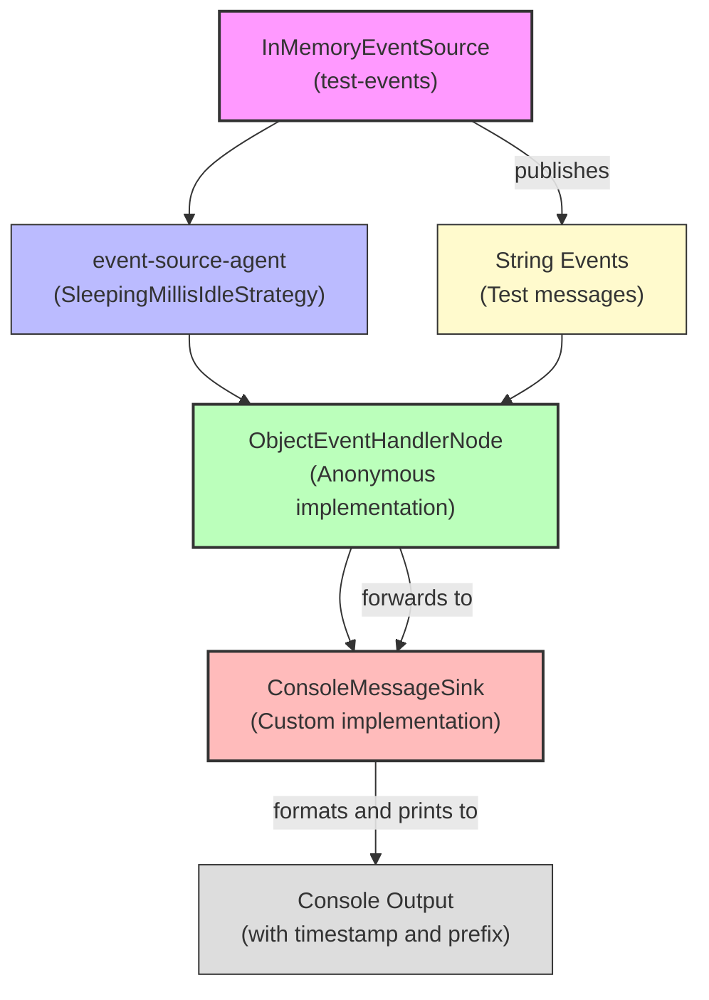

# Message Sink Example

**Mongoose project homepage:** https://telaminai.github.io/mongoose/

[](https://github.com/telaminai/mongoose-examples/actions/workflows/ci.yml)

This is a Maven project that demonstrates how to create a custom message sink by extending the `AbstractMessageSink` class. The example shows how to:

- Create a custom message sink that formats and outputs events
- Configure the sink with customizable properties
- Integrate the sink into a Mongoose Server
- Process and publish events through the sink

The example's main class:

- [MessageSinkExample](src/main/java/com/telamin/mongoose/example/messagesink/MessageSinkExample.java)

## Flow Diagram

The following diagram illustrates the flow of events through the system:



Mongoose maven dependency:

```xml
<dependencies>
    <dependency>
        <groupId>com.telamin</groupId>
        <artifactId>mongoose</artifactId>
        <version>${mongoose.version}</version>
    </dependency>
</dependencies>
```

## What it demonstrates

- Creating a custom message sink by extending `AbstractMessageSink`
- Implementing the `Lifecycle` interface for proper resource management
- Configuring the sink with customizable properties
- Formatting messages before output
- Wiring the sink to an event handler
- Configuring and registering the sink with a Mongoose Server

## What is a Message Sink?

A message sink in Mongoose is a component that receives processed events and forwards them to an external system or output. The `AbstractMessageSink` is a base class that:

1. Provides the infrastructure for receiving events via the `accept(Object)` method
2. Handles the lifecycle of the sink (init, start, stop, tearDown)
3. Applies optional value mapping before sending to the sink
4. Delegates the actual output to the `sendToSink(T)` method implemented by subclasses

By extending this class, you can create custom sinks that output events to various destinations such as files, databases, message queues, or in this example, the console with custom formatting.

## Prerequisites

- Java 21+
- Maven 3.8+
- Access to the com.telamin:mongoose dependency (installed locally or available in your Maven repositories)
    - If you are developing alongside the Mongoose repo, run `mvn -q install` in the Mongoose project first to install
      it to your local repository, and ensure the version in this example's pom.xml (<mongoose.version>) matches.

## Sample code

### Custom Message Sink

The sample below shows how to create a custom message sink by extending `AbstractMessageSink`:

```java
public class ConsoleMessageSink extends AbstractMessageSink<Object> implements Lifecycle {

    @Getter
    @Setter
    private String prefix = "EVENT";

    @Getter
    @Setter
    private boolean includeTimestamp = true;

    @Getter
    @Setter
    private String timestampFormat = "yyyy-MM-dd HH:mm:ss.SSS";

    private DateTimeFormatter formatter;

    @Override
    public void init() {
        // Lightweight initialization
        log.info("Initializing ConsoleMessageSink");
    }

    @Override
    public void start() {
        // Initialize the formatter with the configured format
        formatter = DateTimeFormatter.ofPattern(timestampFormat);
        log.info("Started ConsoleMessageSink with prefix: " + prefix + 
                 ", includeTimestamp: " + includeTimestamp + 
                 ", timestampFormat: " + timestampFormat);
    }

    @Override
    protected void sendToSink(Object value) {
        if (value == null) {
            return;
        }

        StringBuilder sb = new StringBuilder();
        
        // Add timestamp if configured
        if (includeTimestamp) {
            sb.append("[").append(LocalDateTime.now().format(formatter)).append("] ");
        }
        
        // Add prefix
        sb.append(prefix).append(": ");
        
        // Add the actual message
        sb.append(value);
        
        // Print to console
        System.out.println(sb);
    }

    @Override
    public void stop() {
        log.info("Stopping ConsoleMessageSink");
        // Flush System.out to ensure all messages are printed
        System.out.flush();
    }

    @Override
    public void tearDown() {
        log.info("Tearing down ConsoleMessageSink");
        stop();
    }
}
```

Key points:
- The class extends `AbstractMessageSink<Object>`, specifying that it can handle any type of object
- It implements the `Lifecycle` interface to properly manage resources
- It provides configurable properties for customizing the output format
- The `sendToSink(Object value)` method formats the message and prints it to the console
- The `start()` method initializes the formatter with the configured format
- The `stop()` method flushes the output to ensure all messages are printed

### Custom ObjectEventHandlerNode

The sample below shows how to create a custom ObjectEventHandlerNode that injects a MessageSink with @ServiceRegistered
annotated method and forwards events to the sink

```java
public class MyObjectEventHandlerNode extends ObjectEventHandlerNode {
    private MessageSink sink;

    @ServiceRegistered
    public void register(MessageSink sink, String name) {
        this.sink = sink;
    }

    @Override
    protected boolean handleEvent(Object event) {
        if (event instanceof String s) {
            // The handler receives the event and forwards it to the sink
            // In a real application, you might transform or enrich the event here
            if (sink != null) {
                sink.accept(s);
            }
            return true;
        }
        return true;
    }
}
```


### Main Application

The main application sets up the message sink and demonstrates how to use it with Mongoose:

```java
public static void main(String[] args) throws Exception {
    // Create a custom console message sink with specific configuration
    ConsoleMessageSink consoleSink = new ConsoleMessageSink();
    consoleSink.setPrefix("MONGOOSE-EVENT");
    consoleSink.setIncludeTimestamp(true);
    consoleSink.setTimestampFormat("HH:mm:ss.SSS");

    // Create a simple event handler that processes string events and forwards them to the sink
    var handler = new MyObjectEventHandlerNode();

    // Configure the event processor
    var eventProcessorConfig = EventProcessorConfig.builder()
            .customHandler(handler)
            .name("string-event-handler")
            .build();

    // Create an in-memory event source for publishing test events
    InMemoryEventSource<String> eventSource = new InMemoryEventSource<>();

    // Configure the event feed
    EventFeedConfig<?> eventFeed = EventFeedConfig.builder()
            .instance(eventSource)
            .name("test-events")
            .agent("event-source-agent", new SleepingMillisIdleStrategy(10))
            .broadcast(true)  // Broadcast to all processors without explicit subscription
            .build();

    // Configure the message sink
    EventSinkConfig<?> sinkConfig = EventSinkConfig.builder()
            .instance(consoleSink)
            .name("console-sink")
            .build();

    // Build the Mongoose server configuration
    MongooseServerConfig serverConfig = MongooseServerConfig.builder()
            .addProcessor("processor-agent", eventProcessorConfig)
            .addEventFeed(eventFeed)
            .addEventSink(sinkConfig)
            .build();

    // Boot the Mongoose server
    MongooseServer server = MongooseServer.bootServer(serverConfig);

    // Publish some test events
    eventSource.offer("Hello, Mongoose!");
    eventSource.offer("This is a test message");
    eventSource.offer("Custom message sink example");
    eventSource.offer("Events are formatted with timestamps");
    
    // Shutdown the server
    server.stop();
}
```

How it boots and runs:

- Create a custom `ConsoleMessageSink` with specific formatting options
- Create a simple event handler that forwards string events to the sink
- Configure the event processor with this handler
- Create an in-memory event source for publishing test events
- Configure the event feed, processor, and sink
- Boot a Mongoose server with this configuration
- Publish sample events to demonstrate the message sink in action

## Build

From this project directory:

- Build: `./mvnw -q package`

## Run

There are two common ways to run the example:

1) Via your IDE:

- Set the main class to `com.telamin.mongoose.example.messagesink.MessageSinkExample`

2) Via the JAR:

- Build: `./mvnw -q package`
- Run: `java -jar target/message-sink-example-1.0-SNAPSHOT.jar`

Expected output:

```
Starting Mongoose server with custom ConsoleMessageSink...

Publishing test events...

[14:25:30.123] MONGOOSE-EVENT: Hello, Mongoose!
[14:25:30.623] MONGOOSE-EVENT: This is a test message
[14:25:31.123] MONGOOSE-EVENT: Custom message sink example
[14:25:31.623] MONGOOSE-EVENT: Events are formatted with timestamps

Test events published. Press Ctrl+C to exit or wait 5 seconds for automatic shutdown.

Shutting down Mongoose server...
Server stopped.
```

The output shows:
- The formatted events with timestamps and the configured prefix
- Each event is processed by the handler and forwarded to the sink
- The sink formats the events according to its configuration

## Notes

- This example demonstrates how to create a custom message sink that formats and outputs events, which is useful for logging, monitoring, or integrating with external systems.
- The `AbstractMessageSink` provides a convenient base class for creating custom sinks that can be integrated with Mongoose.
- The example uses a simple console output, but the same pattern can be used to create sinks for databases, message queues, files, or other destinations.
- In a real application, you would typically use the `@ServiceRegistered` annotation to wire the sink to the handler, rather than doing it directly in the `start()` method.
- The example demonstrates how to configure the sink with customizable properties, which allows for flexible configuration.

## Links

- Mongoose GitHub repository: https://github.com/telaminai/mongoose
- Mongoose project homepage: https://telaminai.github.io/mongoose/
- Example source in this project: [MessageSinkExample](src/main/java/com/telamin/mongoose/example/messagesink/MessageSinkExample.java)