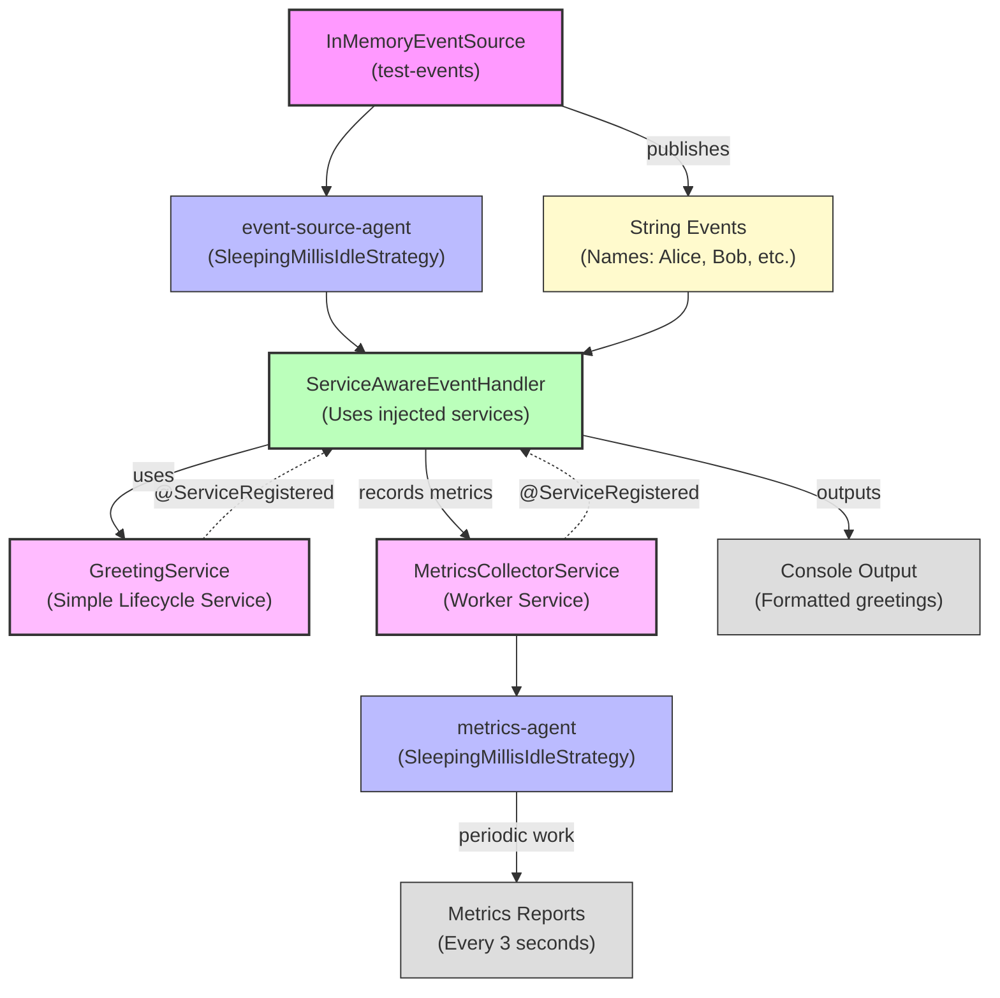

# Service Plugin Example

**Mongoose project homepage:** https://telaminai.github.io/mongoose/

[](https://github.com/telaminai/mongoose-examples/actions/workflows/ci.yml)

This is a Maven project that demonstrates how to create custom service plugins by implementing service components that can be registered with Mongoose server. The example shows how to:

- Create a simple lifecycle-based service
- Create a worker service that runs on its own agent thread
- Inject services into event handlers using @ServiceRegistered
- Configure and register services with MongooseServerConfig

The example's main class:

- [ServicePluginExample](src/main/java/com/telamin/mongoose/example/service/ServicePluginExample.java)

## Flow Diagram

The following diagram illustrates the flow of events and service interactions through the system:



Mongoose maven dependency:

```xml
<dependencies>
    <dependency>
        <groupId>com.telamin</groupId>
        <artifactId>mongoose</artifactId>
        <version>${mongoose.version}</version>
    </dependency>
</dependencies>
```

## What it demonstrates

- Creating a simple lifecycle-based service that implements the Lifecycle interface
- Creating a worker service that implements both Agent and Lifecycle interfaces
- Using dependency injection with @ServiceRegistered to inject services into event handlers
- Configuring services with ServiceConfig (both simple and agent-hosted)
- Registering services with MongooseServerConfig
- Service lifecycle management (init, start, stop, tearDown)
- Background work execution in worker services

## What is a Service Plugin?

A service plugin in Mongoose is a reusable component that provides functionality to other parts of the system through dependency injection. Services can be:

1. **Simple Lifecycle Services**: Implement the `Lifecycle` interface and provide methods that other components can call
2. **Worker Services**: Implement both `Agent` and `Lifecycle` interfaces and run background tasks on their own threads

Services are registered with the Mongoose server and can be injected into event handlers, processors, and other services using the `@ServiceRegistered` annotation.

## Prerequisites

- Java 21+
- Maven 3.8+
- Access to the com.telamin:mongoose dependency (installed locally or available in your Maven repositories)
    - If you are developing alongside the Mongoose repo, run `mvn -q install` in the Mongoose project first to install
      it to your local repository, and ensure the version in this example's pom.xml (<mongoose.version>) matches.

## Sample code

### Simple Lifecycle Service

The sample below shows how to create a simple service by implementing the Lifecycle interface:

```java
@Log
public class GreetingService implements Lifecycle {

    @Getter
    @Setter
    private String prefix = "Hello";
    
    @Getter
    @Setter
    private String suffix = "!";

    @Override
    public void init() {
        log.info("GreetingService.init - initializing greeting service with prefix: " + prefix);
    }

    @Override
    public void start() {
        log.info("GreetingService.start - greeting service is ready");
    }

    @Override
    public void stop() {
        log.info("GreetingService.stop - stopping greeting service");
    }

    @Override
    public void tearDown() {
        log.info("GreetingService.tearDown - cleaning up greeting service");
        stop();
    }

    public String greet(String name) {
        if (name == null || name.trim().isEmpty()) {
            name = "World";
        }
        return prefix + " " + name + suffix;
    }
}
```

### Worker Service

The sample below shows how to create a worker service that runs background tasks:

```java
@Log
public class MetricsCollectorService implements Agent, Lifecycle {

    @Getter
    @Setter
    private long intervalNanos = 5_000_000_000L; // 5 seconds

    private volatile boolean running;
    private long lastRunNanos;
    
    private final AtomicLong totalWorkCycles = new AtomicLong(0);
    private final AtomicLong totalMessages = new AtomicLong(0);

    @Override
    public int doWork() throws Exception {
        if (!running) {
            return 0;
        }

        long now = System.nanoTime();
        if (now - lastRunNanos >= intervalNanos) {
            lastRunNanos = now;
            
            // Perform periodic work - collect and log metrics
            long cycles = totalWorkCycles.incrementAndGet();
            long messages = totalMessages.get();
            long uptimeSeconds = (System.currentTimeMillis() - startTime) / 1000;
            
            log.info(String.format("Metrics Report - Cycles: %d, Messages: %d, Uptime: %ds", 
                    cycles, messages, uptimeSeconds));
            
            return 1; // Work was done
        }
        
        return 0; // No work done
    }

    @Override
    public String roleName() {
        return "MetricsCollectorService";
    }

    public void recordMessage() {
        totalMessages.incrementAndGet();
    }
}
```

### Service Injection

The sample below shows how to inject services into an event handler:

```java
@Log
public class ServiceAwareEventHandler extends ObjectEventHandlerNode {

    private GreetingService greetingService;
    private MetricsCollectorService metricsService;

    @ServiceRegistered
    public void wireGreetingService(GreetingService greetingService, String name) {
        log.info("ServiceAwareEventHandler - injected GreetingService: " + name);
        this.greetingService = greetingService;
    }

    @ServiceRegistered
    public void wireMetricsService(MetricsCollectorService metricsService, String name) {
        log.info("ServiceAwareEventHandler - injected MetricsCollectorService: " + name);
        this.metricsService = metricsService;
    }

    @Override
    protected boolean handleEvent(Object event) {
        if (event instanceof String message) {
            // Record the message in metrics
            if (metricsService != null) {
                metricsService.recordMessage();
            }

            // Create a greeting using the greeting service
            String greeting = null;
            if (greetingService != null) {
                greeting = greetingService.greetWithContext(message, "from Mongoose!");
            }

            System.out.println("Event processed: " + greeting);
            return true;
        }
        return true;
    }
}
```

### Main Application

The main application shows how to configure and register services:

```java
public static void main(String[] args) throws Exception {
    // Create the services
    GreetingService greetingService = new GreetingService("Welcome", "!!!");
    MetricsCollectorService metricsService = new MetricsCollectorService(3_000_000_000L);

    // Configure the services
    ServiceConfig<GreetingService> greetingServiceConfig = ServiceConfig.<GreetingService>builder()
            .service(greetingService)
            .serviceClass(GreetingService.class)
            .name("greetingService")
            .build();

    ServiceConfig<MetricsCollectorService> metricsServiceConfig = ServiceConfig.<MetricsCollectorService>builder()
            .service(metricsService)
            .serviceClass(MetricsCollectorService.class)
            .name("metricsService")
            .agent("metrics-agent", new SleepingMillisIdleStrategy(100)) // Worker service needs an agent
            .build();

    // Build the Mongoose server configuration
    MongooseServerConfig serverConfig = MongooseServerConfig.builder()
            .addProcessor("processor-agent", eventProcessorConfig)
            .addEventFeed(eventFeed)
            .addService(greetingServiceConfig)
            .addService(metricsServiceConfig)
            .build();

    // Boot the Mongoose server
    MongooseServer server = MongooseServer.bootServer(serverConfig);
}
```

## Build

From this project directory:

- Build: `./mvnw -q package`

## Run

There are two common ways to run the example:

1) Via your IDE:

- Set the main class to `com.telamin.mongoose.example.service.ServicePluginExample`

2) Via the JAR:

- Build: `./mvnw -q package`
- Run: `java -jar target/service-plugin-example-1.0-SNAPSHOT.jar`

Expected output:

```
Starting Mongoose server with custom service plugins...

Publishing test events...

Event processed: Welcome Alice from Mongoose!!!
Event processed: Welcome Bob from Mongoose!!!
Event processed: Welcome Charlie from Mongoose!!!
Event processed: Welcome Diana from Mongoose!!!
Event processed: Welcome Eve from Mongoose!!!

Waiting for metrics collection...
INFO: Metrics Report - Cycles: 1, Messages: 5, Uptime: 8s

Publishing more test events...

Event processed: Welcome Frank from Mongoose!!!
Event processed: Welcome Grace from Mongoose!!!
Event processed: Welcome Henry from Mongoose!!!

INFO: Metrics Report - Cycles: 2, Messages: 8, Uptime: 12s

Test completed. Check the logs for service lifecycle and metrics reports.
Final message count: 8

Shutting down Mongoose server...
Server stopped.
```

The output shows:
- Service lifecycle messages (init, start, stop, tearDown)
- Service injection messages
- Processed events using the greeting service
- Periodic metrics reports from the worker service
- Final statistics

## Notes

- This example demonstrates both types of services: simple lifecycle services and worker services that run background tasks
- Services are automatically injected into components that declare them with @ServiceRegistered
- Worker services must be configured with an agent and idle strategy
- Services participate in the full server lifecycle (init, start, stop, tearDown)
- The example shows how services can interact with each other and with event processing components

## Links

- Mongoose GitHub repository: https://github.com/telaminai/mongoose
- Mongoose project homepage: https://telaminai.github.io/mongoose/
- Example source in this project: [ServicePluginExample](src/main/java/com/telamin/mongoose/example/service/ServicePluginExample.java)